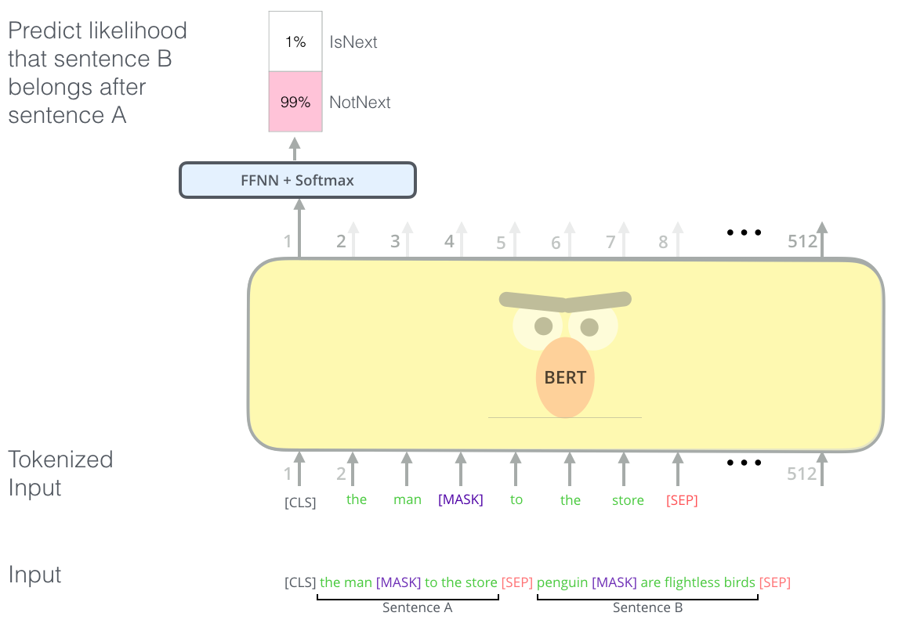

# Contextual Embeddings

"Let's _stick_ to the plan."

"He needs a walking _stick_."

&darr;

_stick_ should be embedded differently depending on the context.

Notes:

---

# BERT

[Google, 2018](https://arxiv.org/abs/1810.04805v2)

Bidirectional Encoder Representations from Transformers

&shy; <!-- .element: class="stretch" -->   

&shy; <!-- .element: style="font-size: small;" --> Source: [http://jalammar.github.io/illustrated-bert/]() 

---

# Sentence understanding

&shy; <!-- .element: class="stretch" --> 

&shy; <!-- .element: style="font-size: small;" --> Source: [http://jalammar.github.io/illustrated-bert/]()

---

# Play time

Back to
the [Notebook](https://github.com/georgms/information-retrieval/blob/gh-pages/word-embedding/Word_Embedding.ipynb).
