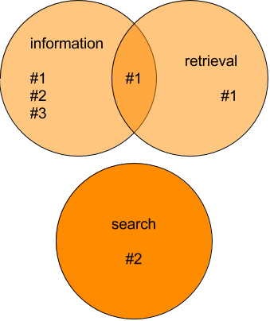

# Simple Boolean Retrieval Implementation

1. Calculate result lists for every query term: `grep`
2. Apply boolean operators: Intersect, Union

---

# Grep

<!-- .slide: class="audience-question" -->

* Query: *book*
* Document: *a book about information retrieval*

Compare query with document, from first to last character

1. <!-- .element: class="fragment fade-in-then-out" data-fragment-index="1" --><span>a␣bo</span><!-- .element: class="fragment highlight-blue" data-fragment-index="1" -->ok about information retrieval
2. <!-- .element: class="fragment fade-in-then-out" data-fragment-index="2" -->a<span>␣boo</span><!-- .element: class="fragment highlight-blue" data-fragment-index="2" -->k about information retrieval
3. <!-- .element: class="fragment" data-fragment-index="3" -->a <span>book</span><!-- .element: class="fragment highlight-blue" data-fragment-index="3" --> about information retrieval <span>&rarr; Match</span><!-- .element: class="fragment" style="color: green;" -->

Notes:
What are some issues with grep?
---

# Try grep

```
unzip files/simple-wikipedia.zip

cd corpus

# Search for "information" in a single document:
grep "information" Information.txt

# Recursively search for "information":
grep --recursive "information" .

# Measure the time it takes and discard the output:
time grep --recursive "information" . >/dev/null

# Count number of matching files
grep --files-with-matches "information" . | wc -l
```

Notes:
How often is "information" found in Information.txt when searching with a text editor? Why the discrepancy?
---

# Calculate result lists

## Generate a list of terms from the query

```
(information AND retrieval) OR search
```

&darr;

1. *information*
2. *retrieval*
3. *search*

## Grep every term in every document

1. *a book about information retrieval*
2. *a book about the search for information*
3. *a book about retrieving information*

Notes:
---
<!-- .slide: class="audience-question" -->

# Generate result lists

**Query term: *information***
&rarr; <span>[#1, #2, #3]</span><!-- .element: class="fragment" data-fragment-index="1" -->

* #1 *a book about information retrieval*
* #2 *a book about the search for information*
* #3 *a book about retrieving information*

**Query term: *retrieval*** &rarr; <span>[#1]</span><!-- .element: class="fragment" data-fragment-index="2" -->

* #1 *a book about information retrieval*
* #2 *a book about the search for information*
* #3 *a book about retrieving information*

**Query term: *search*** &rarr; <span>[#2]</span><!-- .element: class="fragment" data-fragment-index="3" -->

* #1 *a book about information retrieval*
* #2 *a book about the search for information*
* #3 *a book about retrieving information*

Notes:
Audience question
---

<!-- .slide: class="audience-question" --> 

# Intersect / Union

* &shy;<!-- .element: class="fragment" data-fragment-index="1" --> \#1: _a book about information retrieval_

* &shy;<!-- .element: class="fragment" data-fragment-index="1" --> \#2: _a book about the search for information_
* &shy;<!-- .element: class="fragment" data-fragment-index="1" --> \#3: _a book about retrieving information_

```
(information AND retrieval) OR search
```

<!-- .element: class="fragment" data-fragment-index="1" -->

 <!-- .element: class="fragment" data-fragment-index="2" -->

Notes:
Audience question
---

# Complexity

* [Big &Omicron; notation](https://en.wikipedia.org/wiki/Big_O_notation)
* Describe time or memory complexity of algorithms and data structures
* Which inputs influence their runtime and memory requirements?
* Look at worst case

---

# Time complexity examples

*How many loops do you need?*

| Big &Omicron; | Name      | Example                           | Explanation                                   |
|---------------|-----------|-----------------------------------|-----------------------------------------------|
| Ο(1)          | Constant  | Odd or even number?               | No loop                                       |
| Ο(n)          | Linear    | Calculate array sum               | Iterate over all values                       |
| Ο(n²)         | Quadratic | Find duplicates in unsorted array | Compare every value against every other value |

---

<!-- .slide: class="audience-question" -->

# Grep Complexity

Search every query term as a string in every document: <!-- .element: class="fragment" -->

$$O(\text{num query terms} \times \text{total length of all documents})$$<!-- .element: class="fragment" -->

Can take reaaally long<!-- .element: class="fragment" -->

Notes:
Audience question
---

# Grep complexity example

* *English Wikipedia*: 6M articles, 12B characters, 1.2M
  distinct terms
* grep: 2 query terms &times; 12GB = **24 billion string comparisons**

Notes:
How can this be improved?

---

<!-- .slide: class="audience-question" -->

# Grep disadvantages

* &shy;<!-- .element: class="fragment" -->   Does _books_ match _book_?
    * &shy;<!-- .element: class="fragment" -->Cannot deal with singular / plural, *books* does not match *book*.
* &shy;<!-- .element: class="fragment" --> _go_ vs _went_
* &shy;<!-- .element: class="fragment" --> _running_ vs _run_
* &shy;<!-- .element: class="fragment" --> _go_ vs _gong_

Not user friendly!<!-- .element: class="fragment" -->

Notes:
More examples?