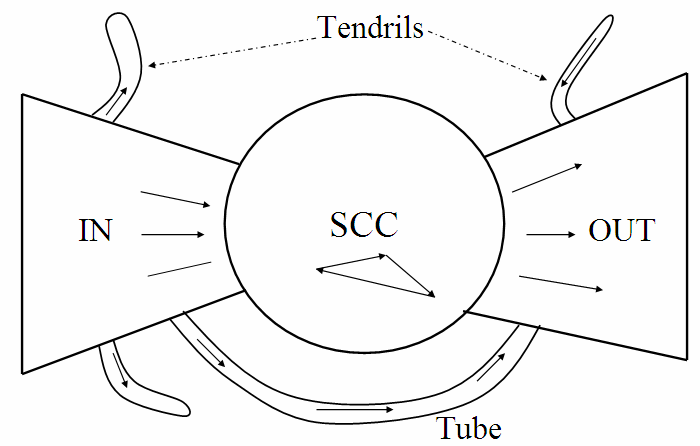

# Internet Structure
---

# Internet structure

* Directed graph connected by hyperlinks
* Not strongly connected

Notes:
---

# Nomenclature

<dl>
  <dt>In-links / Out-links</dt>
  <dd>Incoming / Outgoing links</dd>
  
  <dt>In-degree / Out-degree</dt>
  <dd>Number of incoming / outgoing links</dd>
</dl>

Notes:
---

# Internet structure

* B
    * In-degree: *3* &shy;<!-- .element: class="fragment" data-fragment-index="" -->
    * Out-degree: *1* &shy;<!-- .element: class="fragment" data-fragment-index="" -->

Notes: Audience question
---

# Internet structure

Number of web pages with in-degree *i* = $\frac{1}{i^{2.1}}$

    <!--
     {
      "width": "800",
      "height": "600",
      "xAxis": {
       "domain": ["0", "20"],
       "label": "In-degree"
      },
      "yAxis": {
       "domain": ["0", "10000"],
       "label": "Proportional number of pages"
      },
      "data": [{ "fn": "10000*1/nthRoot(x, 2.1)" }]
    }
    -->

---
# Internet structure

<!-- .element: class="stretch" -->

Notes:
