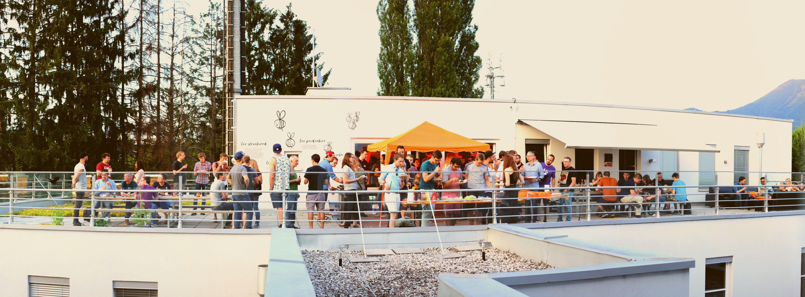

# Information Retrieval 101

Georg M. Sorst, Principal
Engineer @ [<!-- .element: style="height: 1em; margin: 0; vertical-align: middle;" -->](https://nosto.com)<!-- .element: target="_blank" -->

---

# Administrative

---

# Me

* Georg M. Sorst
* Principal
  Engineer @ [<!-- .element: style="height: 1em; margin: 0; vertical-align: middle;" -->](https://nosto.com)<!-- .element: target="_blank" --> (
  formerly [<!-- .element: style="height: 1em; margin: 0; vertical-align: middle;" -->](https://findologic.com)<!-- .element: target="_blank" -->)
* Leading E-Commerce recommendation & search provider

---

---

# Org

* Some coding homework during the semester.
* Final project: Find data set, build search.
* Exam optional.
* Participation is relevant for your grade, and helps us learn better. Asking questions is also participation!
* I will pick random people from the [Wheel of Names](https://wheelofnames.com/) to answer questions during the lecture.
  This helps up stay awake.
* Have a question? Too slow? Too fast? Let me know right away!
* Who will be my timekeeper? Time to [spin the Wheel](https://wheelofnames.com/).

---

<!-- .slide: class="audience-question" -->

&larr; These slides contain small comprehension questions for you. I will pick a random person to answer the question.
