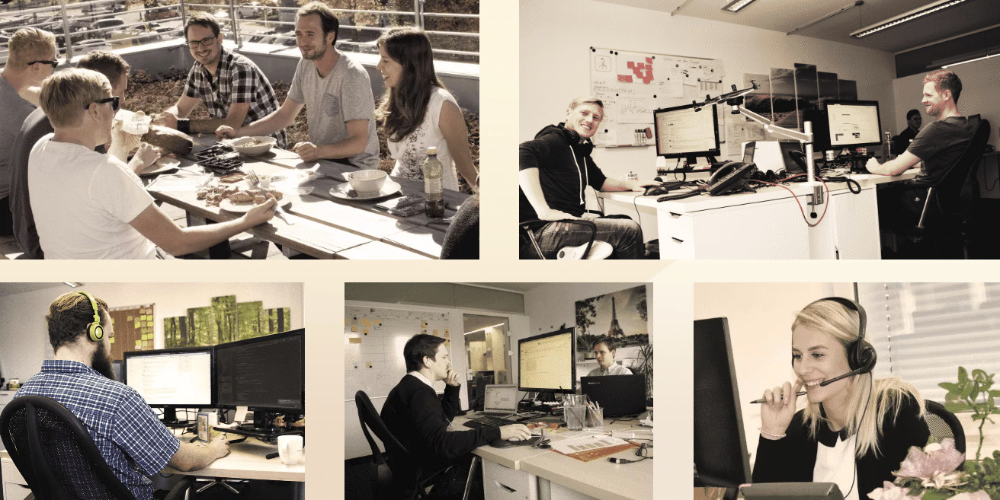
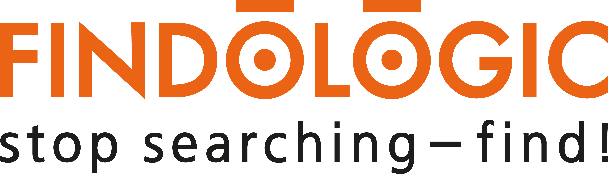

# Information Retrieval

Georg M. Sorst, Principal Engineer @ Nosto
---
# Administrative
---
# Me

* Georg M. Sorst
* Principal Engineer @ [Nosto](https://nosto.com) (formerly Findologic)
* Leading E-Commerce recommendation & search provider 
---
<!-- .element: class="stretch" style="border: none; box-shadow: none; vertical-align: middle;" -->
---
# Career @ <!-- .element: class="stretch" style="height: 100px; border: none; box-shadow: none; vertical-align: middle;" -->

* Internship, thesis, full time
* Buzzwords:
    * Vue, Vuetify, Material Design, Typescript, Laravel, Kotlin
    * IntelliJ, WebStorm, PHPStorm, YouTrack, GitHub
    * Kubernetes, Ansible, Docker, Vagrant
    * Solr
    * Wuzler, Dart, PlayStation
---
# Org

* Some coding homework during the semester.
* Final project: Find data set, build search.
* Participation is relevant for your grade, and helps us learn better. Asking questions is also participation!
* I will pick random people from the [Wheel of Names](https://wheelofnames.com/) to answer questions during the lecture. This helps up to stay awake.
* Have a question? Too slow? Too fast? Let me know right away!
* I will record the lecture. Ok?
* Who will be my timekeeper? Time to [spin the Wheel](https://wheelofnames.com/).
* When online:
    * Please turn on your cameras. Otherwise, I feel like I'm talking to my computer.
    * Break every ~45 minutes.
