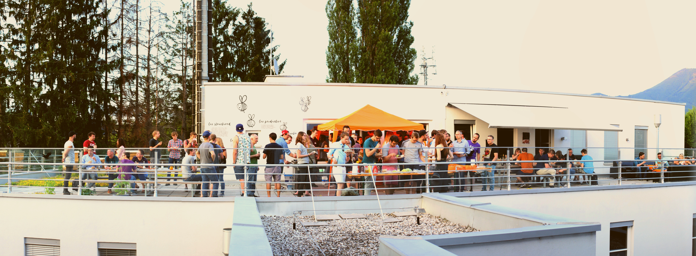

# Information Retrieval 101

Georg M. Sorst, Head of Search Engineering @ [<!-- .element: style="height: 1em; margin: 0; vertical-align: middle;" -->](https://nosto.com)<!-- .element: target="_blank" -->

---

# Administrative

---

# Me

* Georg M. Sorst
* Head of Search Engineering @ [<!-- .element: style="height: 1em; margin: 0; vertical-align: middle;" -->](https://nosto.com)<!-- .element: target="_blank" --> (
  formerly [<!-- .element: style="height: 1em; margin: 0; vertical-align: middle;" -->](https://findologic.com)<!-- .element: target="_blank" -->)
* Leading E-Commerce recommendation & search provider

---

---

# Grading

* Final grade: 3x Final project, 2x participation, 1x homework
* Final project: Find data set, build search.
* Participation helps us learn better together.
* Asking questions is also participation!
* Some coding homework during the semester.
* Exam optional

---

# During the lecture

* Please close your laptop for maximum attention (unless we're doing an interactive task).
* To help us stay awake I will pick random people from the [Wheel of Names](https://wheelofnames.com/) to answer questions during the lecture.
* Have a question? Too slow? Too fast? Let me know right away!
* Who will be my timekeeper? Time to [spin the Wheel](https://wheelofnames.com/).

---

<!-- .slide: class="audience-question" -->

&larr; These slides contain small comprehension questions for you.

I will pick a random person to answer the question.

---

# Setup

1. Install [Elasticsearch for local development](https://www.elastic.co/docs/deploy-manage/deploy/self-managed/local-development-installation-quickstart).
2. Clone [lecture repository](https://github.com/georgms/information-retrieval).