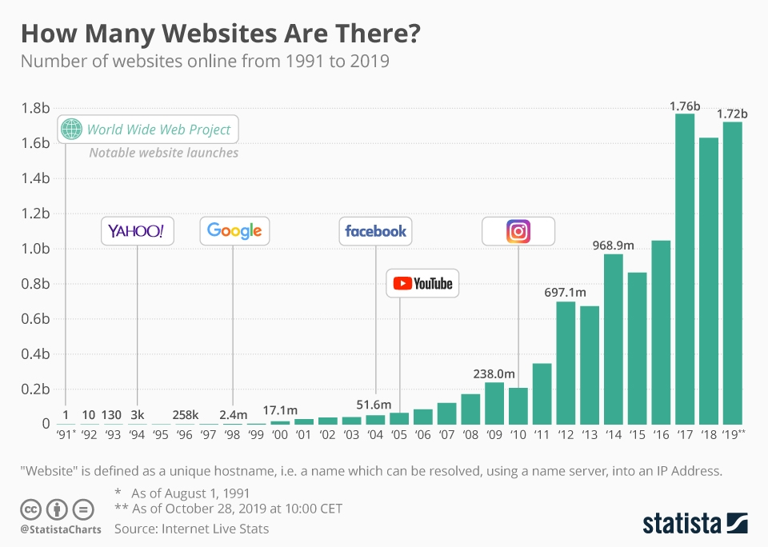

# Motivation
---

# Information Retrieval

> Information retrieval (IR) is the activity of obtaining information system resources relevant to an information need
> from a collection.

> Web search engines are the most visible IR applications.

Notes:
What is the motivation for information retrieval? What are some use cases?
---

---

---

---

# Search is everywhere

* Internet
* eCommerce
* CMS, Blogs
* Intranet
* Academia
* ...

---

# Challenges

* High result quality
* User friendly
* Fast, scalable

---

# Outlook

* Understand fundamental search data structures and algorithms
* BYOG (Build your own Google)
* Use Solr to build search-enabled applications
* Further topics: Clustering, word embeddings, text classification, …                 
