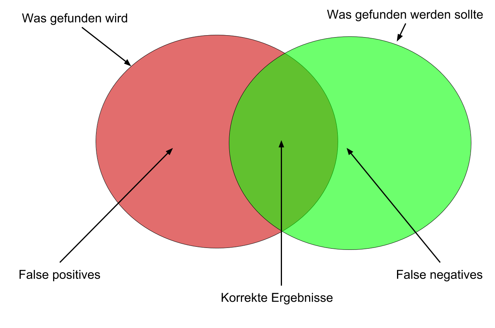
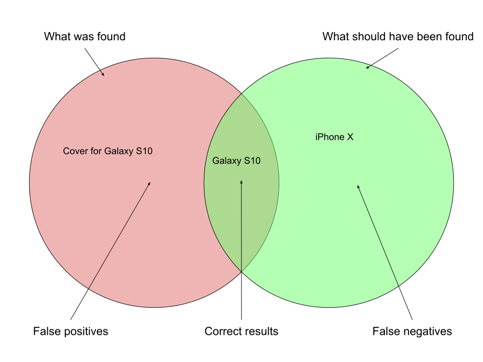

# Precision & Recall

Notes:
---

# Precision

Are all results relevant?

Notes:
---

# Recall

Are all relevant documents in the results?

Notes:
---

<!-- .slide: class="audience-question" -->

Notes:
How to evaluate?
---

# Evaluation

* Requires human effort
* Manually annotated corpus:

----

| Information Need     | iPhone X | Galaxy S10 | Cover for Galaxy S10 | Battery Pack |
|----------------------|----------|------------|----------------------|--------------|
| smartphone           | ✓        | ✓          | -                    | -            |
| apple smartphone     | ✓        | -          | -                    | -            |
| smartphone accessory | -        | -          | ✓                    | ✓            |

Augment with click-stream logs

Notes:
---

<!-- .slide: class="audience-question" -->

&shy;<!-- .element: class="stretch" -->

Precision for _smartphone_? 50%<!-- .element: class="fragment" -->

Recall for _smartphone_? 50%<!-- .element: class="fragment" -->

Notes:

* Audience question

---

# Precision & Recall

* &shy;<!-- .element: class="fragment" --> Will never be 100% both, so:
* &shy;<!-- .element: class="fragment" --> Rank results according to relevance

Notes:

* How to achieve 100% recall?
* What could be criteria for ranking results?
