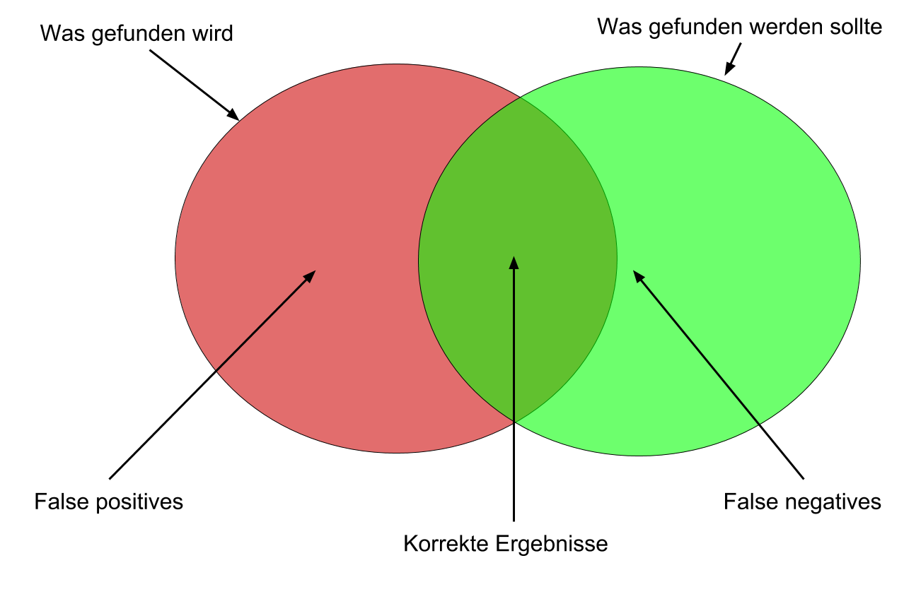
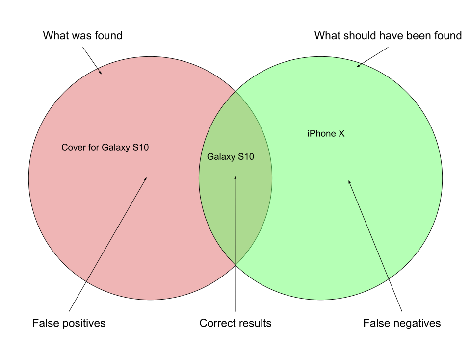

# Precision & Recall

Notes:
---

# Precision

Are all results relevant?

$$\text{Precision} = \frac{\text{number of relevant results}}{\text{total number of results}}$$

Notes:
---

# Recall

Are all relevant documents in the results?

$$\text{Recall} = \frac{\text{number of relevant documents that were found}}{\text{total number of relevant
documents}}$$

Notes:
---

<!-- .slide: class="audience-question" -->

Notes:
How to evaluate?
---

# Evaluation

* Requires human effort
* Manually annotated corpus:

----

| Product &rarr; &darr; Query | iPhone X | Galaxy S10 | Cover for Galaxy S10 | Battery Pack |
|---------------------------------|----------|------------|----------------------|--------------|
| smartphone                      | ✓        | ✓          | -                    | -            |
| apple smartphone                | ✓        | -          | -                    | -            |
| smartphone accessory            | -        | -          | ✓                    | ✓            |

Augment with click-stream logs

Notes:
---

<!-- .slide: class="audience-question" -->

&shy;<!-- .element: class="stretch" -->

Precision for _smartphone_? 33%<!-- .element: class="fragment" -->

Recall for _smartphone_? 50%<!-- .element: class="fragment" -->

Notes:

* Audience question

---

# Precision & Recall

<!-- .slide: class="audience-question" -->

* &shy;<!-- .element: class="fragment" --> Will never be 100% both, so:
* &shy;<!-- .element: class="fragment" --> Rank results according to relevance

Notes:

* How to achieve 100% recall?
* What could be criteria for ranking results?
