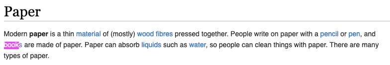
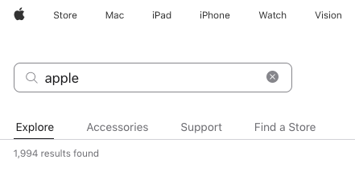
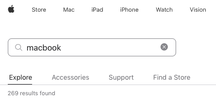

# Ranked retrieval

Notes:

---

# Idea I

More matches for query term = more relevant document




Wikipedia article on `book` vs. `paper`

Notes:

---

# Idea II

Infrequent terms in corpus are more relevant





Searching apple.com for `apple macbook`: `macbook` more relevant than `apple`

Notes:

---

# I: Term frequency

<!-- .slide: class="audience-question" -->

### <!-- .element: class="fragment" --> At index time:

* &shy;<!-- .element: class="fragment" --> Count term occurrences per doc
* &shy;<!-- .element: class="fragment" --> Ignore order of terms
* &shy;<!-- .element: class="fragment" --> _Bag of words_

&shy;<!-- .element: class="fragment" --> 

Notes:

* Where to save TF info?

---

# TF

<!-- .slide: class="audience-question" -->

* \#1: _a book providing information about information retrieval_
* \#2: _a book about the search for books_
* \#3: _a book about information_

***

| Term        | Doc IDs                                              |
|-------------|------------------------------------------------------|
| Book        | #1:1, #2:2, #3:1 <!-- .element: class="fragment" --> |
| Information | #1:2, #3:1 <!-- .element: class="fragment" -->       |
| Retrieval   | #1:1         <!-- .element: class="fragment" -->     |
| Search      | #2:1         <!-- .element: class="fragment" -->     |

Notes:

* Audience participation

---

# II: Inverse document frequency

<!-- .slide: class="audience-question" --> 

* &shy;<!-- .element: class="fragment" --> Searching apple.com for `apple OR macbook`
    * fewer documents with `macbook` than `apple`
    * `macbook` more important
* &shy;<!-- .element: class="fragment" --> Rank uncommon terms higher
* &shy;<!-- .element: class="fragment" --> Only relevant for OR search
* &shy;<!-- .element: class="fragment" --> Store inverse document frequency per term

Notes:

* Why is it only relevant for OR search?
* Why is it stored per term?
* What is the min and max IDF? Why?

---

# Inverse Document Frequency

$$\begin{aligned}
\text{idf}(\text{term}) & = \frac{\text{num_docs}}{\text{document_frequency}(\text{term})}\\\\
\\\\
\text{idf}(\text{apple}) & = \frac{10}{9} = 1.1 \\\\
\\\\
\text{idf}(\text{macbook}) & = \frac{10}{2} = 5
\end{aligned}$$
---

# IDF

<!-- .slide: class="audience-question" -->

* \#1: _a book providing information about information retrieval_
* \#2: _a book about the search for books_
* \#3: _a book about information_

***

| Term        | IDF                                    | Doc IDs          |
|-------------|----------------------------------------|------------------|
| Book        | 1  <!-- .element: class="fragment" --> | #1:1, #2:2, #3:1 |
| Information | 1.5<!-- .element: class="fragment" --> | #1:2, #3:1       |
| Retrieval   | 3  <!-- .element: class="fragment" --> | #1:1             |
| Search      | 3  <!-- .element: class="fragment" --> | #2:1             |

Notes:

* idf(t) = 1 is a special case
* Audience participation

---

# TF-IDF Ranking

$$\text{score}(\text{query}, \text{document}) = \sum_{\text{term} \in \text{query}} \left( \text{tf}(\text{term},
\text{document}) \times \text{idf}(\text{term}) \right)$$

Notes:

* Explain formula in human-speak.

---

<!-- .slide: class="audience-question" --> 

| Term        | IDF | Doc IDs          |
|-------------|-----|------------------|
| Book        | 1   | #1:1, #2:2, #3:1 |
| Information | 1.5 | #1:2, #3:1       |
| Retrieval   | 3   | #1:1             |
| Search      | 3   | #2:1             |

```
information retrieval search
```

### \#1

2 &times; 1.5 + 1 &times; 3 + 0 &times; 3 = 6 <!-- .element: class="fragment" -->

### \#2

0 &times; 1.5 + 0 &times; 3 + 1 &times; 3 = 3 <!-- .element: class="fragment" -->

### \#3

1 &times; 1.5 + 0 &times; 3 + 0 &times; 3 = 1.5 <!-- .element: class="fragment" -->

Notes:

---

# Try it out

<a class="es-console" href="es-consoles/tf-idf.http">Try TF-IDF ranking in Elasticsearch</a>.
