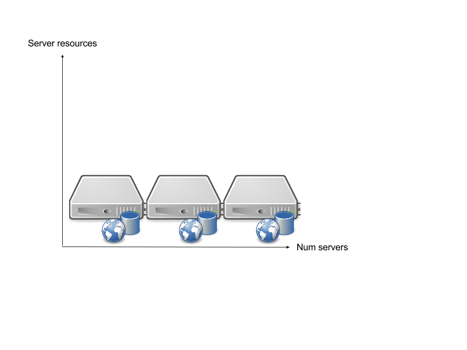
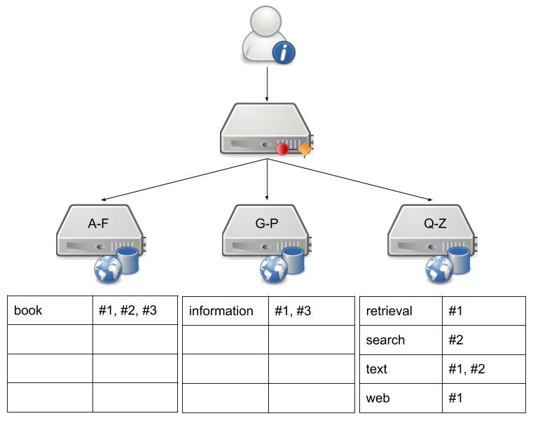
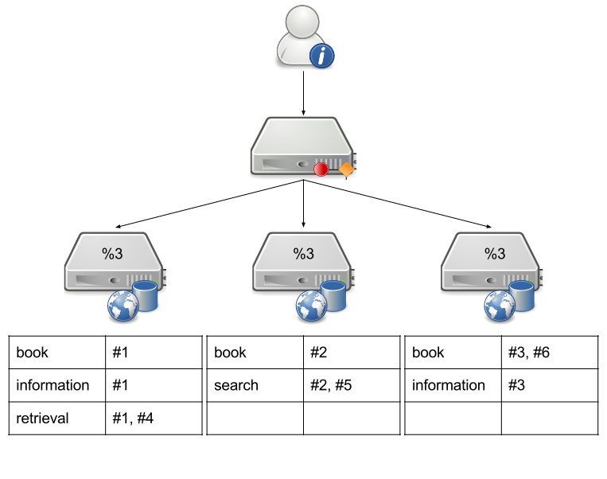
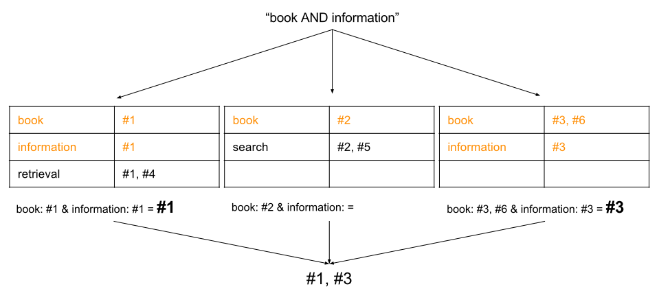

# Scaling

Notes:
---
# Scaling reasons

* Queries per second / Traffic / Concurrency  <!-- .element: class="fragment" -->
* Index size / Time per query <!-- .element: class="fragment" -->
* Resiliency <!-- .element: class="fragment" -->

Notes:
Scaling reasons?
---
# Scaling

 <!-- .element: style="border: none; box-shadow: none;" -->

Notes:
What are the two directions we can scale to?
---
# Scaling up / Vertical

 <!-- .element: style="border: none; box-shadow: none;" -->

Notes:

(Dis-)Advantages of Scaling up?
---
# Scaling up

* \+ Easy
* \+ Little overhead (network, hardware)
* \- No fault-tolerance
* \- No concurrency
* \- Scaling limited by hardware

<!-- .element: style="list-style-type: none;" -->

Notes:
---
# Scaling out / Horizontal

 <!-- .element: style="border: none; box-shadow: none;" -->

Notes:

(Dis-)Advantages of Scaling out?
---
# Scaling out

* \+ Fault-tolerance, resiliency
* \+ Concurrency
* \+ "Unlimited" scaling
* \- Complex
* \- Overhead: Network, Monitoring

<!-- .element: style="list-style-type: none;" -->

Notes:
---
# Distributed search

 <!-- .element: style="border: none; box-shadow: none;" -->

Notes:
---
# Distributed search

* Partitioned index
* Distributed queries

Notes:
---
# Non-Partitioned index

| Term        | Doc IDs    |
|-------------|------------|
| Book        | #1, #2, #3 |
| Information | #1, #2, #3 |
| Retrieval   | #1         |
| Search      | #2         |

Notes: Audience question: How to partition? There are two ways along the axes of the table.
---
# Partitioned index

* By term
* By doc

Notes:
How can the index be partitioned? Think of the Inverted Index.
---
# Term-partitioned index

&shy;<!-- .element: class="stretch" -->

<!-- .element: style="border: none; box-shadow: none;" -->

Notes:

(Dis-)Advantages of Term-partitioned index?
---
# Term-partitioned index

* \+ Single term queries are easy
* \- Uneven distribution
* \- Index updates hit all servers

<!-- .element: style="list-style-type: none;" -->

Notes:
---
# Document-partitioned index

&shy;<!-- .element: class="stretch" -->

<!-- .element: style="border: none; box-shadow: none;" -->

Notes:

(Dis-)Advantages of Term-partitioned index?
---
# Document-partitioned index

* \+ Even distribution
* \+ Easy to update index
* \+ Completely independent partial indices
* \- Even single query terms are complex

<!-- .element: style="list-style-type: none;" -->

Notes:
---
# Document-partitioned index

* Number of nodes is fixed
* $\text{node}(\text{doc}) = \text{id}(\text{doc}) \, \% \, \text{num}(\text{nodes})$
* $\text{node}(\text{#4}) = 4 \, \% \, 3 = 1$

Notes:
---
# Distributed query

&shy;<!-- .element: class="stretch" -->

<!-- .element: style="border: none; box-shadow: none;" -->

Notes:

What is the performance improvement? Assume a query takes 1s on a single node.
---
# Performance improvement

* 1 node: $n$ documents per index $\approx$ $m$ seconds per query
* 2 nodes: $\frac{n}{2}$ documents per index $\approx$ $\frac{m}{2}$ seconds per query
* …

$$\text{Distributed query time} \approx \frac{\text{Non-distributed query time}}{\text{Number of nodes}}$$<!--
.element: class="fragment" -->
---
# What's left to scale?

* More traffic
* Less downtimes

Notes:
How?
---
# Sharding

&shy;<!-- .element: class="stretch" -->

<!-- .element: style="border: none; box-shadow: none;" -->

Notes:
---
# Sharding nomenclature

<dl>
  <dt>Shard</dt><!-- .element: class="fragment" data-fragment-index="1" -->
  <dd>
    <ul>
      <li>Slice of document collection</li>
    </ul> 
</dd><!-- .element: class="fragment" data-fragment-index="1" -->
  
  <dt>Master / Leader / Primary</dt><!-- .element: class="fragment" data-fragment-index="2" -->
  <dd>
    <ul>
      <li>Distribute requests to Replicas</li>
      <li>Distribute requests to other Masters</li>
    </ul>
  </dd><!-- .element: class="fragment" data-fragment-index="2" -->
  
  <dt>Replica</dt><!-- .element: class="fragment" data-fragment-index="3" -->
  <dd>
    <ul>
      <li>Contains all documents of shard</li>
      <li>Will actually handle queries</li>
      <li>Can become Master</li>
    </ul>
  </dd><!-- .element: class="fragment" data-fragment-index="3" -->
</dl>

Notes:
---
# More shards

* More docs
* Better query parallelization
    * A single query is faster
    * $\text{Shards} \times 2 \approx \text{Index} \div 2 \approx \text{Performance} \times 2$

Notes:
---
# More Replicas

* Better resiliency
* Better concurrency
    * More queries can be handled in parallel
    * $\text{Replicas} \times 2 \approx \text{Parallel queries} \times 2$

Notes:
