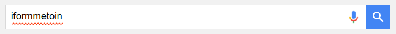
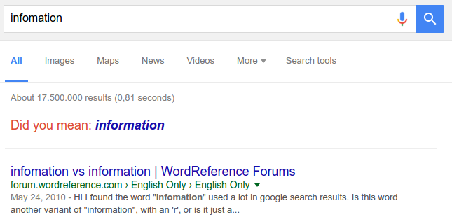
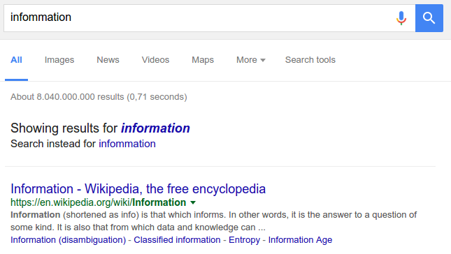
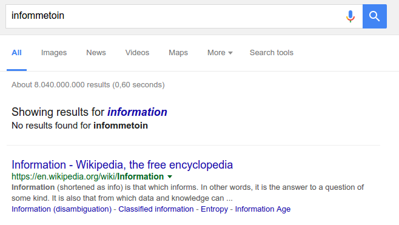
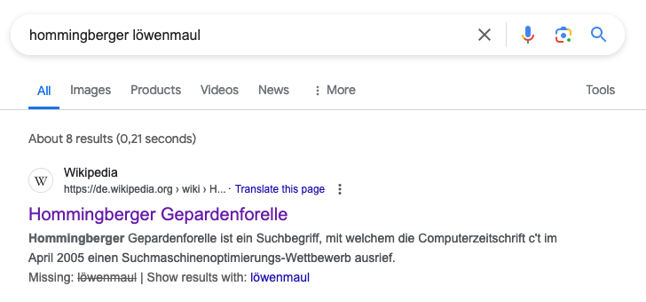

# Spelling correction

*Palystation, Xboy, Wiii*

Notes:

---

# Spelling correction

<!-- .slide: class="audience-question" -->

 <!-- .element: class="fragment" style="border: none;" -->

1. <!-- .element: class="fragment" --> Find alternatives
2. <!-- .element: class="fragment" --> Evaluate alternatives
3. <!-- .element: class="fragment" --> Return alternative results

Notes:

* How can we find alternatives?

---

# 1. Find alternatives

`bock~`

(Levenshtein, N-Gram)

&darr;

`book`, `rock`, `spock`

Notes:

---

# 2. Evaluate alternatives

<!-- .slide: class="audience-question" -->

Notes:

* How can we evaluate alternatives? Which metrics could be applied?

---

# Context

* &shy;<!-- .element: class="fragment" data-fragment-index="1" --> Find alternatives for every misspelled query term
  &rarr; *collations*
* &shy;<!-- .element: class="fragment" data-fragment-index="2" --> Search for collation and evaluate results

* &shy;<!-- .element: class="fragment" data-fragment-index="4" --> `seach endine`?
* &shy;<!-- .element: class="fragment" data-fragment-index="5" --> `seach` &rarr; `peach, search`
* &shy;<!-- .element: class="fragment" data-fragment-index="6" --> `endine` &rarr; `ending, engine`

* &shy;<!-- .element: class="fragment" data-fragment-index="8" --> `seach endine`?
* &shy;<!-- .element: class="fragment" data-fragment-index="9" --> &rarr; `peach engine`? 0 results
* &shy;<!-- .element: class="fragment" data-fragment-index="10" --> &rarr; `peach ending`? 0 results
* &shy;<!-- .element: class="fragment" data-fragment-index="11" -->&rarr; `search ending`
    <!-- .element: class="fragment highlight-current-blue" data-fragment-index="13" --> ? 5 results
* &shy;<!-- .element: class="fragment" data-fragment-index="12" -->&rarr; `search engine`
    <!-- .element: class="fragment highlight-current-blue" data-fragment-index="13" --> ? 10 results

Notes:

---

# Evaluate alternatives

* Most results
* Best results
* Most searched

Notes:

---

# 3. Return alternative results

<!-- .slide: class="audience-question" -->

* Feedback
* Transparency

Notes:

* How does this affect precision and recall?
* What kind of spelling corrections does Google offer? What are the typical scenarios?

---

# Did you mean

* Original query has decent results
* There is a better alternative

Notes:

---

# Instead

* Original query has poor results
* There is a better alternative

Notes:

---

# Showing results for

* Original query has no results
* There is an alternative

Notes:

---

# Show results with

* No good results including all search terms
* Selectively remove some of the search terms
