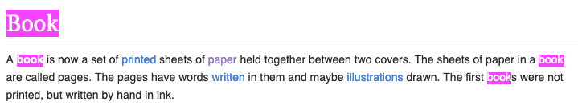
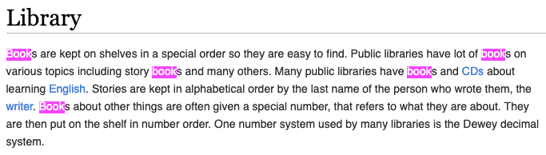

# TF pitfalls

<!-- .slide: class="audience-question" -->

What can be some issues with term frequency as a relevance indicator?

---

# Not always true

$$\text{tf} (\text{book}) = 4$$

$$\text{tf} (\text{book}) = 5$$

---

# Spam

<!-- .slide: class="audience-question" -->

$$\text{tf}(\text{"money"}, \text{"money money money"}) > \text{tf}(\text{"money"}, \text{"Legit document about
money"})$$

Spam should be prevented.<!-- .element: class="fragment" -->

Notes:

* Who can explain what the formula means and why this is an issue?

---

# Multi-term queries

<!-- .slide: class="audience-question" -->

$$\text{tf}(\text{"cat OR dog"}, \text{"cat cat cat"}) > \text{tf}(\text{"cat OR dog"}, \text{"cat dog"})$$

Documents which match all query terms should be ranked higher.<!-- .element: class="fragment" -->

Notes:

* Who can explain what the formula means and why this is an issue?

---

# Document length

<!-- .slide: class="audience-question" -->

$$\text{tf}(\text{"cat"}, \text{"cat"}) < \text{tf}(\text{"cat"}, \text{"cat dog mouse elephant cat"})$$

Term frequency should be normalized with the document length.<!-- .element: class="fragment" -->

Notes:

* Who can explain what the formula means and why this is an issue?

---

# Meanwhile, in the real world...

* Elasticsearch default is now [Okapi BM25](https://en.wikipedia.org/wiki/Okapi_BM25)
* Also based on TF-IDF
* Much less descriptive:

$${\displaystyle {\text{score}}(D,Q)=\sum_{i=1}^{n}{log(1+\frac {N-DF(D)+0.5}{(DF(D)+0.5})}\cdot {\frac {TF(q_i,D)}{TF(q_i,D)
+k_1\cdot \left(1-b+b\cdot {\frac {|D|}{\text{avgdl}}}\right)}}}$$ <!-- .element: class="fragment" -->

Notes:
