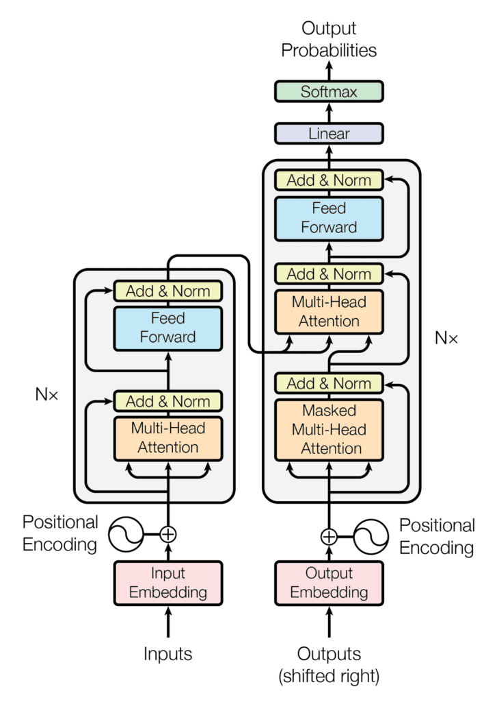

# Transformer

* New model architecture introduced in [Attention is All You Need](https://arxiv.org/abs/1706.03762)
* Understands relationships between words in a document
* Applies attention weight between any inputs ("self-attention")

---

&shy; <!-- .element: class="stretch" --> 

&shy; <!-- .element: style="font-size: small;" --> Source: [Attention is All You Need](https://arxiv.org/abs/1706.03762)

---

# Large Language Models (LLMs)

* Transformer trained with huge amounts of data.
* Neural Network with millions or billions of weights.

---

# Play time

Back to
the [Notebook](https://github.com/georgms/information-retrieval/blob/gh-pages/word-embedding/Word_Embedding.ipynb).
