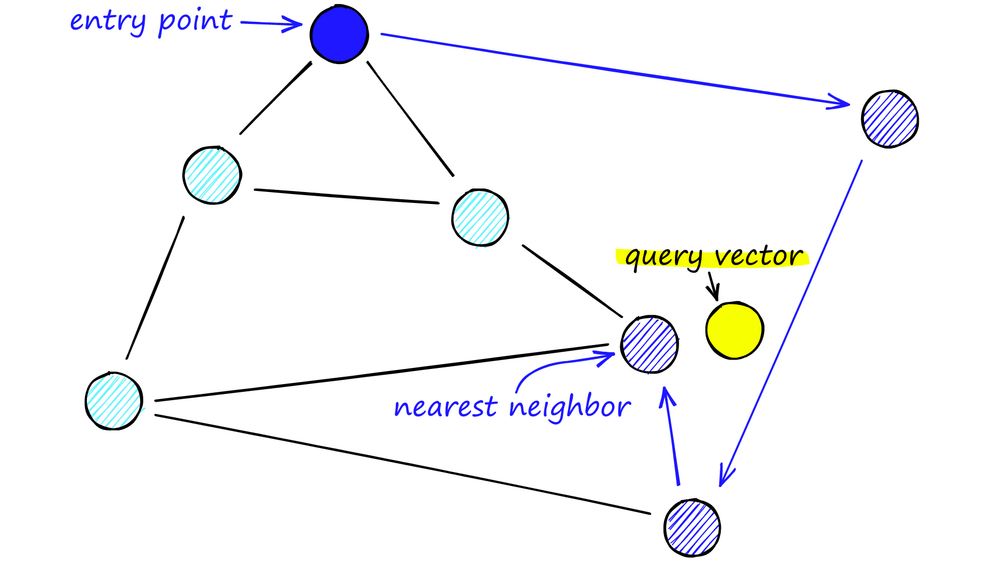
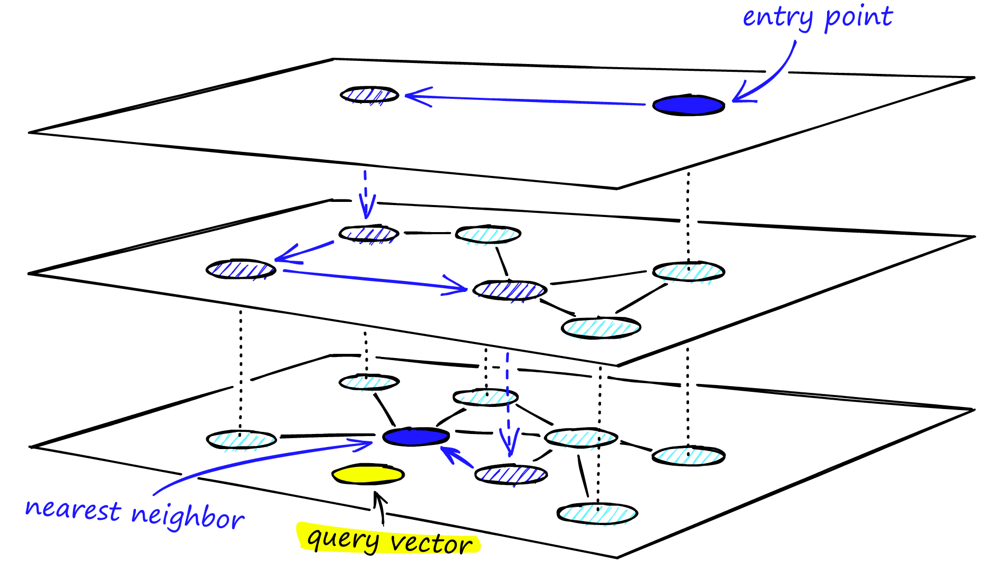

# Vector Search

* Encode documents.
* Encode query.
* Find nearest neighbors.

---

# Index

`a book about information retrieval`

&darr;

LLM

&darr;

[1.3, 2.7, 1.1]

&darr;

| Document                                | Vector          |
|-----------------------------------------|-----------------|
| a book about information retrieval      | [1.3, 2.7, 1.1] |
| a book about the search for information | [2.4, 0.3, 3.5] |
| a book about retrieving information     | [0.1, 2.0, 1.1] |          

---

# Search

`finding stuff`

&darr;

LLM

&darr;

[1.1, 0.4, 2.3]

&darr;

| Document                                | Vector          | Cosine Similarity |
|-----------------------------------------|-----------------|-------------------|
| a book about information retrieval      | [1.3, 2.7, 1.1] | 0.6               |
| a book about the search for information | [2.4, 0.3, 3.5] | 0.56              |
| a book about retrieving information     | [0.1, 2.0, 1.1] | 0.58              |

---

# Performance

<!-- .slide: class="audience-question" -->

* $O(n)$ performance for brute force cosine similarity
* Naive Cosine Similarity does not scale.
* Must scale for millions of documents.

Notes:
* What is the complexity for brute force cosine similarity? 

---

# Approximate Nearest Neighbors

* Vector Search is fuzzy anyway.
* Finding approximately the best results is good enough.
* And it's much faster!

---

# Navigable Small World Graph

&shy; <!-- .element: class="stretch" --> 

Source: [pinecone.io](https://www.pinecone.io/learn/series/faiss/hnsw/)
<!-- .element: style="font-size: small;" -->

$O(log(n))$ for less than a few thousand nodes.

---

# Hierarchical Navigable Small World Graph (HNSW)

&shy; <!-- .element: class="stretch" --> 

Source: [pinecone.io](https://www.pinecone.io/learn/series/faiss/hnsw/)
<!-- .element: style="font-size: small;" -->

---

# Relevance

<!-- .slide: class="audience-question" -->

* For keyword search, only documents that contain query terms are returned.
* For vector search, _every_ document vector is more or less similar to every query vector.

Notes:
* Why is every document vector more or less similar?

---

`cats and dogs`

&darr;

LLM

&darr;

| Document                                | Vector          | Cosine Similarity |
|-----------------------------------------|-----------------|-------------------|
| a book about information retrieval      | [1.3, 2.7, 1.1] | 0.12              |
| a book about the search for information | [2.4, 0.3, 3.5] | 0.05              |
| a book about retrieving information     | [0.1, 2.0, 1.1] | 0.37              |

---

# Relevance

* Where to cut off the results?
* Just return Top 50 similar documents?
* What if there are just no meaningful results?

---

# Hybrid Scoring

* Combine vector search results and keyword search results into one result set

---

# Reciprocal Rank Fusion

`search algorithms`

&darr;

| Document                                   | Keyword Rank | Vector Rank | Total Result                      |
|--------------------------------------------|--------------|-------------|-----------------------------------|
| #1 a book about the search for information | 1            | 3           | $\frac{1}{1} + \frac{1}{3} = 1.3$ |
| #2 a book about information retrieval      | 2            | 1           | $\frac{1}{2} + \frac{1}{1} = 1.5$ |
| #3 a book about retrieving information     | -            | 2           | $0 + \frac{1}{2} = 0.5$           |

&darr;

#2, #1, #3

