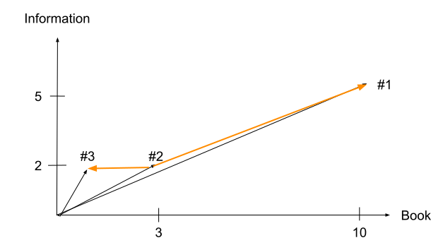
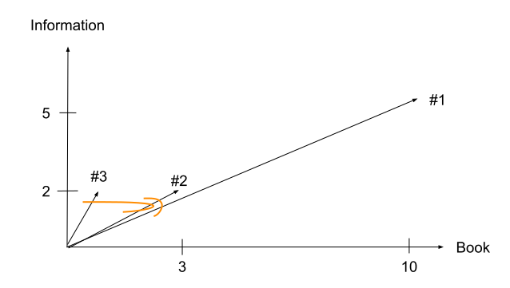
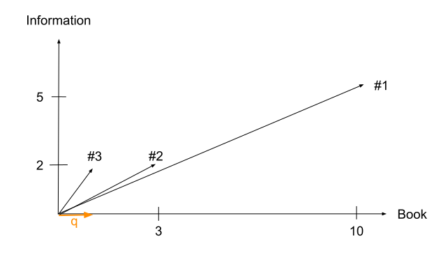

# Vector Space Model

Notes:
---
# Vector Space Model

Calculate similarity between

* queries and docs <!-- .element: class="fragment" -->
* docs and docs <!-- .element: class="fragment" -->
* queries and queries <!-- .element: class="fragment" -->

Notes:
* Use case for queries-docs?
* Use case for doc-doc?
* Use case for query-query?
---
# Vector Space Model

* Queries / docs are vectors <!-- .element: class="fragment" -->
* Term-document Matrix &rarr; document vector <!-- .element: class="fragment" -->

Notes:
How can a document be a vector?
---
# Document vector

|             | #1 | #2 | #3 |
|-------------|----|----|----|
| Book        | 10 | 3  |  1 |
| Information | 5  | 2  |  2 |

***

* $\vec{V}(\\#1)$ = (10, 5) <!-- .element: class="fragment" -->
* $\vec{V}(\\#2)$ = (3, 2) <!-- .element: class="fragment" -->
* $\vec{V}(\\#3)$ = (1, 2) <!-- .element: class="fragment" -->

Notes:
---
* $\vec{V}(\\#1)$ = (10, 5)
* $\vec{V}(\\#2)$ = (3, 2)
* $\vec{V}(\\#2)$ = (1, 2)

&shy;<!-- .element: class="stretch" -->

<!-- .element: style="border: none; box-shadow: none;" -->

Notes: Are the docs similar?
---
# Vector distance

&shy;<!-- .element: class="stretch" -->

<!-- .element: style="border: none; box-shadow: none;" -->

Notes:
---
# Vector distance

$$\textrm{d}(p, q) = \sqrt{(q_1 - p_1)^2 + (q_2 - p_2)^2}$$

Notes:
---
# Vector distance

$$\begin{aligned}
\textrm{d}(\\#1, \\#2) & = \sqrt{(10 - 3)^2 + (5 - 2)^2} \\\\
& = \sqrt{7^2 + 3^2} \\\\
& = \sqrt{49 + 9} \\\\
& = \sqrt{58} \\\\
& \approx 7.62 \\\\
\\\\
\textrm{d}(\\#2, \\#3) & = \sqrt{(3 - 1)^2 + (2 - 2)^2} \\\\
& \approx 2
\end{aligned}$$

Notes:
---
* Documents look similar but vector distance is pretty big
* &shy;<!-- .element: class="fragment" --> Vector distance does not consider document size
* &shy;<!-- .element: class="fragment" --> Need a better measure that accounts for longer documents
---
* $\vec{V}(\\#1)$ = (10, 5)
* $\vec{V}(\\#2)$ = (3, 2)
* $\vec{V}(\\#2)$ = (1, 2)

&shy;<!-- .element: class="stretch" -->

<!-- .element: style="border: none; box-shadow: none;" -->

Notes:
---
&shy;<!-- .element: class="stretch" -->

<!-- .element: style="border: none; box-shadow: none;" -->

Notes:
---
# Unit vector

$$\vec{v} = \frac{\vec{V} }{ |\vec{V}| }$$

Notes:
---
# Unit vector

$$\begin{aligned}
\vec{v}(\\#1) & = \frac{ \begin{pmatrix}10\\\\5\end{pmatrix} }{ \sqrt{10^2 + 5^2} } \\\\ \\\\
& = \frac{ \begin{pmatrix}10\\\\5\end{pmatrix} }{ 11.18 } \\\\ \\\\
& = \begin{pmatrix}0.89\\\\0.45\end{pmatrix}
\end{aligned}$$

Notes:
---
# Unit vector

$$\begin{aligned}
|\vec{v}(\\#1)| & = \sqrt{0.89^2 + 0.45^2} \\\\
& = \sqrt{1} \\\\
& = 1
\end{aligned}$$
---
# Cosine similarity

$$\textrm{sim}(d_1, d_2) = \frac{ \vec{V}(d_1) }{ |\vec{V}(d_1)|} \cdot \frac{\vec{V}(d_2) }{ |\vec{V}(d_2)| } =
\frac{ \vec{V}(d_1) \vec{V}(d_2) }{ |\vec{V}(d_1)| |\vec{V}(d_2)| }$$

***

* 1.0 means equality (same vector direction)
* 0.0 means maximum difference (90° between vectors)

Notes: Why can't there be more than 90° difference?
---
<h1>Cosine similarity</h1>

$$\begin{aligned}
\textrm{sim}(\\#1, \\#2) & = \frac{ \begin{pmatrix}10 \\ 5\end{pmatrix} \cdot \begin{pmatrix}3 \\\\
2\end{pmatrix} }{ \left|\begin{pmatrix}10 \\ 5\end{pmatrix}\right| \left|\begin{pmatrix}3 \\\\
2\end{pmatrix}\right| } \\\\
& = \frac{30 + 10}{\sqrt{10^2 + 5^2} \sqrt{3^2 + 2^2}} \\\\
& = \frac{40}{\sqrt{125} \sqrt{13}} = \frac{40}{40.31} \\\\
& \approx 0.99 \\\\
\\\\
\textrm{sim}(\\#2, \\#3) & \approx 0.875
\end{aligned}$$
---
# Query vector

* "*book*"
* Vocabulary: `[book, information]`
* $\vec{V}(q) = \begin{pmatrix}1 \\\\ 0\end{pmatrix}$ <!-- .element: class="fragment" -->

Notes:
What does the query vector look like?
---
&shy;<!-- .element: class="stretch" -->
<!-- .element: style="border: none; box-shadow: none;" -->

Notes:
What does the query vector look like?
---
# Query vector

&shy;<!-- .element: class="stretch" -->

<!-- .element: style="border: none; box-shadow: none;" -->

Notes: Audience question: Which doc is most similar to the query?
---
# Query vector

$$sim(\\#1, q) = \frac{ \begin{pmatrix}10 \\\\ 5\end{pmatrix} \cdot \begin{pmatrix}1 \\\\ 0\end{pmatrix} }{ \left\|\begin{pmatrix}10 \\\\ 5\end{pmatrix}\right\| \left\|\begin{pmatrix}1 \\\\ 0\end{pmatrix}\right\| } = 0.89$$ <!-- .element: class="fragment" -->

$$sim(\\#2, q) = \frac{ \begin{pmatrix}3 \\\\ 2\end{pmatrix} \cdot \begin{pmatrix}1 \\\\ 0\end{pmatrix} }{ \left\|\begin{pmatrix}3 \\\\ 2\end{pmatrix}\right\| \left\|\begin{pmatrix}1 \\\\ 0\end{pmatrix}\right\| } = 0.83$$ <!-- .element: class="fragment" -->

Notes:
