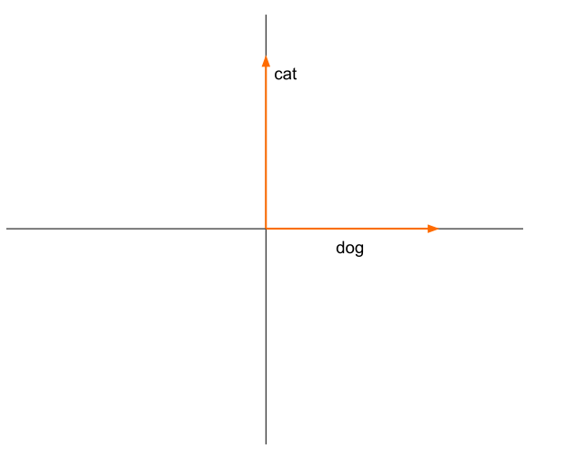
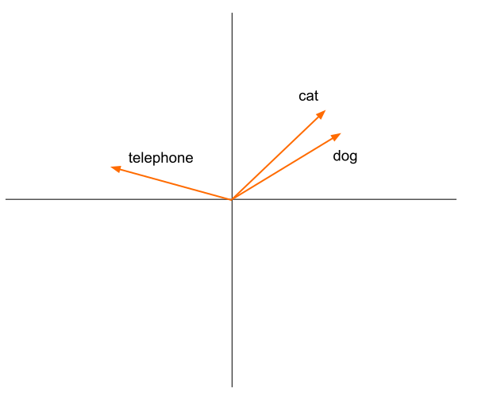

 # I ssues

Words are represented as one-hot vectors:

$$\vec{V}(\text{book}) = \begin{pmatrix}0 \\\\ 0 \\\\ 0 \\\\ ... \\\\ 1 \\\\ 0\end{pmatrix}$$

* One vector component is 1, all others are 0.
* This takes up a lot of space.

---

# Issues

Semantically similar words have completely different vectors.

&shy;<!-- .element: class="stretch" -->

---

# Issues

<!-- .slide: class="audience-question" -->

Slow to compute.

Query vector needs to be compared with every document vector. <!-- .element: class="fragment" -->

Notes:

* Why is it slow to compute?

---

# Approach

Compress one-hot vectors to dense vectors with fewer dimensions.

$$\vec{V}(\text{book}) = \begin{pmatrix}2.77  \\\\ 0.13 \\\\ 8.6 \\\\ 2.1 \\\\ 5.73\end{pmatrix}$$

---

# Approach

Calculate similar vectors for semantically related words.

&shy;<!-- .element: class="stretch" -->

---

# Approach

* Build vector index
* Compute approximate nearest vector.