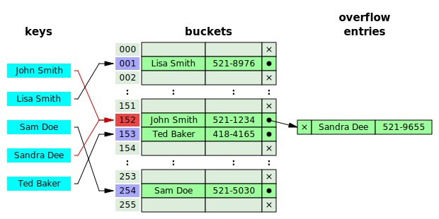

# Vocabulary structure

Notes:
---
# Vocabulary structure

* &shy;<!-- .element: class="fragment" --> Dictionary / Hash table
* &shy;<!-- .element: class="fragment" --> Search tree

Notes:
* Suggestions?
---
# Hash table

&shy;<!-- .element: class="stretch" -->

&shy;<!-- .element: style="font-size: small;" --> By Jorge Stolfi - Own work, CC BY-SA
3.0, https://commons.wikimedia.org/w/index.php?curid=6471238

Notes:
* What is the complexity of lookup / insert? Does it get slower with more entries?
---
# Hash table

* \+ Fast lookup: &Omicron;(1): Calculate hash, follow pointer
* \+ Fast insert: &Omicron;(1)
* \- Hash collisions: Worst case complexity: &Omicron;(n)

<!-- .element: style="list-style-type: none;" -->

Notes:
---
# Hash table collision

&shy;<!-- .element: class="stretch" -->

&shy;<!-- .element: style="font-size: small;" --> By Jorge Stolfi - Own work, CC BY-SA
3.0, https://commons.wikimedia.org/w/index.php?curid=6472274

Extra lookup necessary when hashes collide. Worst case &Omicron;(n)

Notes:
---
<h1>Search Tree</h1>

Max two children per node (binary tree)

Notes: 
What is the lookup / insert complexity? Does it get slower with more entries? How much? Ο(log n)
---
# Search Tree

* \+ Fast lookup: &Omicron;(log n): Average height of the tree
* \+ Fast insertion: &Omicron;(log n)
* \+ Supports prefix search

<!-- .element: style="list-style-type: none;" -->

***

* Different types of trees used depending on the use case
* E.g., Binary Tree (in-memory), B-Tree (on disk)

Notes:
