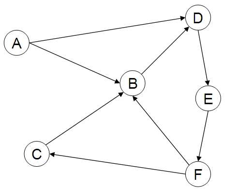

# Web crawling

Notes:

---

# Web crawler requirements

### Robustness <!-- .element: class="fragment" data-fragment-index="1" -->

Handle malicious and faulty pages <!-- .element: class="fragment" data-fragment-index="1" -->

### Politeness <!-- .element: class="fragment" data-fragment-index="2" -->

Rate limit <!-- .element: class="fragment" data-fragment-index="2" -->

Notes:
Audience question

---

# Web crawler requirements

### Distributed <!-- .element: class="fragment" data-fragment-index="1" -->

Scalable, efficient <!-- .element: class="fragment" data-fragment-index="1" -->

### Quality <!-- .element: class="fragment" data-fragment-index="2" -->

Crawl "good" pages more frequently <!-- .element: class="fragment" data-fragment-index="2" -->

### Freshness <!-- .element: class="fragment" data-fragment-index="3" -->

Keep index up-to-date <!-- .element: class="fragment" data-fragment-index="3" -->

### Extensible <!-- .element: class="fragment" data-fragment-index="4" -->

Data formats, protocols <!-- .element: class="fragment" data-fragment-index="4" -->

Notes:
Audience question

---

# Crawling

<!-- .element: style="padding: 25px;" class="stretch" -->

[Source](https://de.wikipedia.org/wiki/Datei:WebCrawlerArchitecture.svg)

Notes:

---

# URL Queue

* aka. *Crawl frontier*
* Priority queue

$$\text{priority} = f(\text{quality}, \text{importance}, \text{change rate})$$

Notes:

---

# Distributed Crawling

* Partition by domain
* Cache DNS
* Locality

Notes:

---

# Link graph

Notes:

---

# Link graph

* Connectivity servers / indices
* Store web graph, in- and out-links
* Support graph queries: in- / out-links, in- / out-degree, traversal
* Used for link analysis, etc.

Notes:
