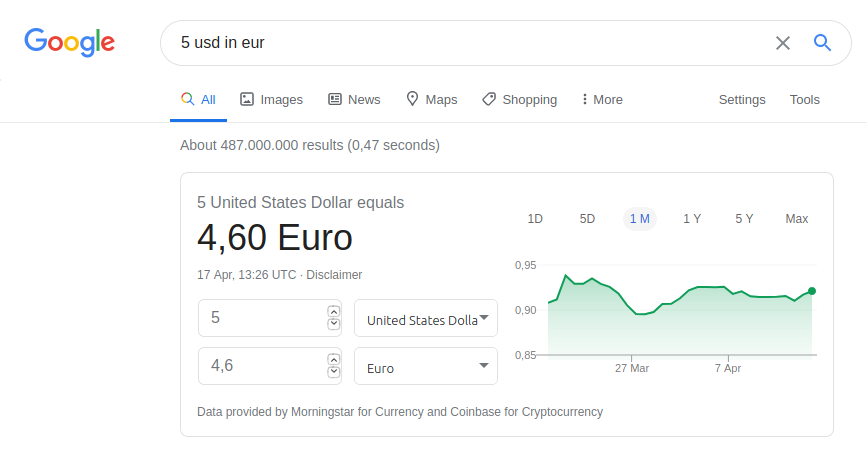
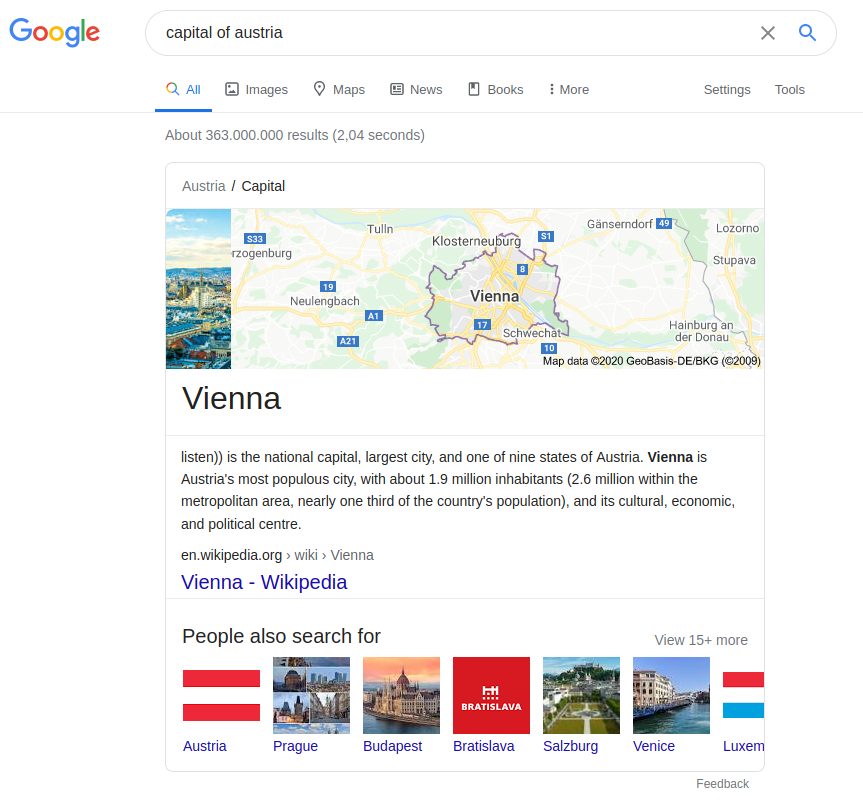
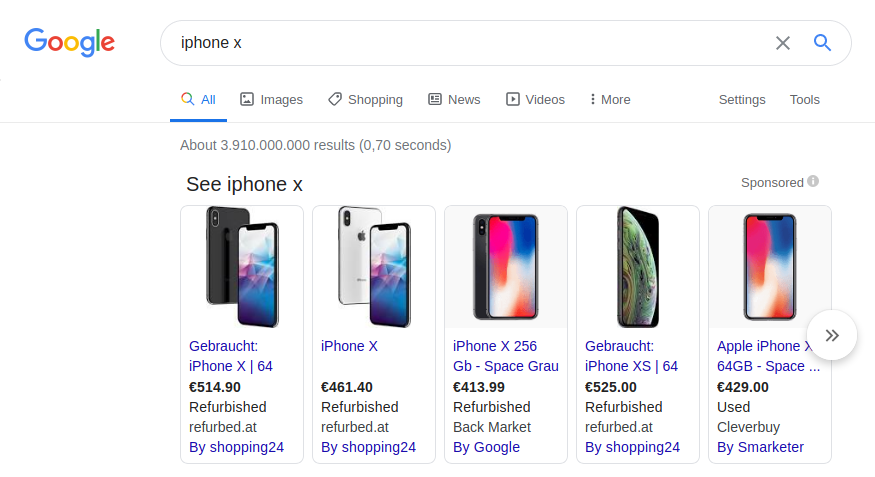
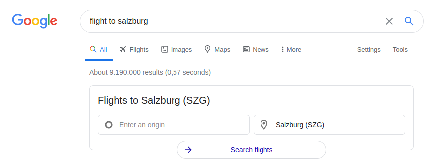
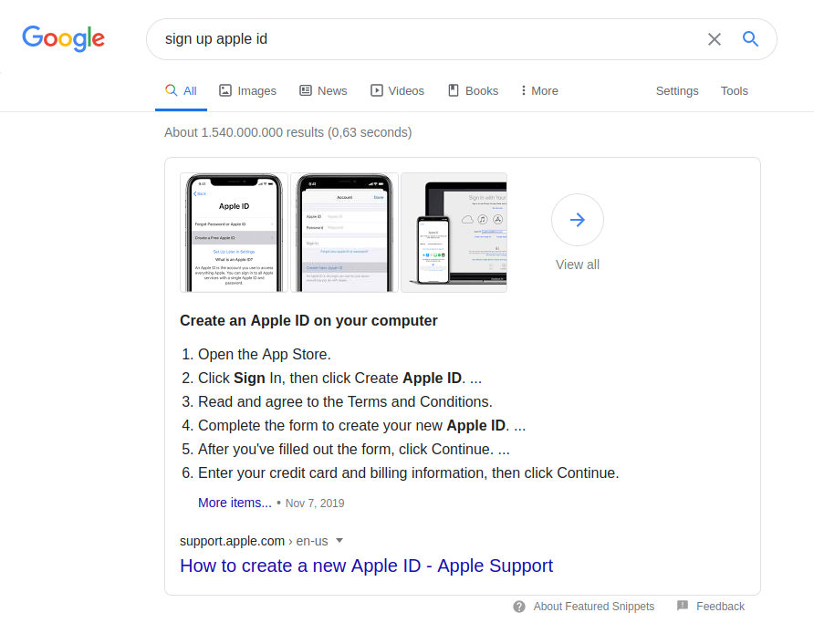
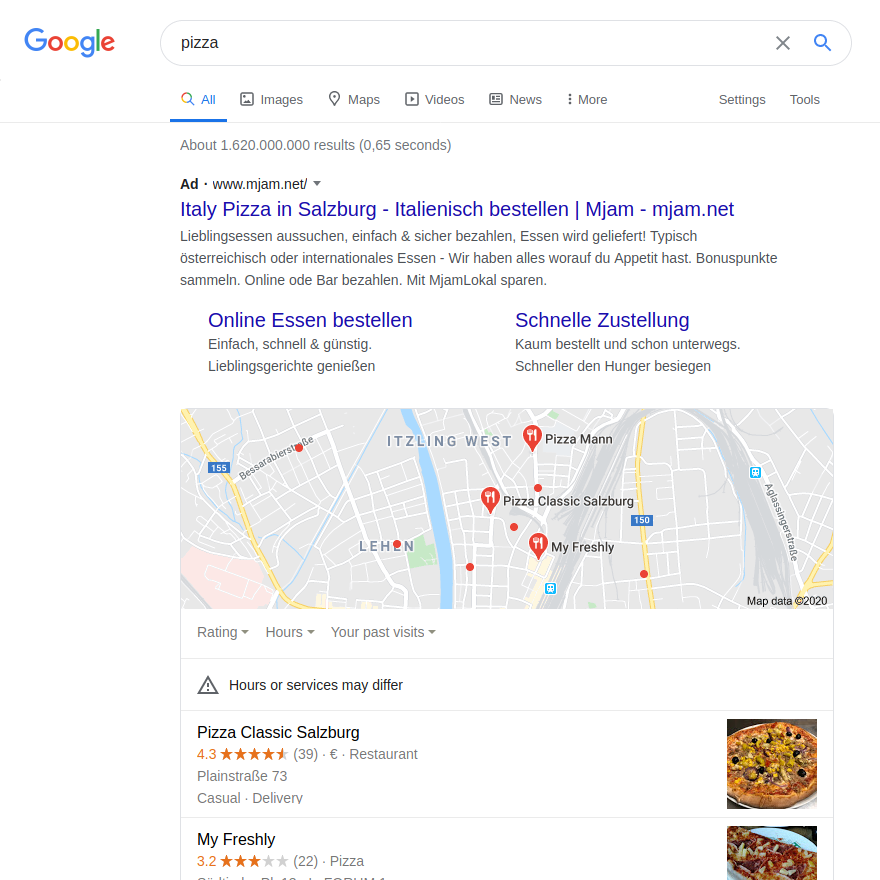
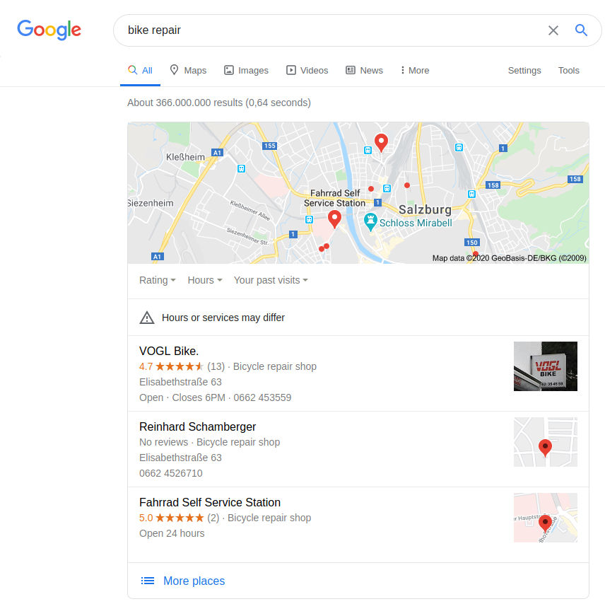
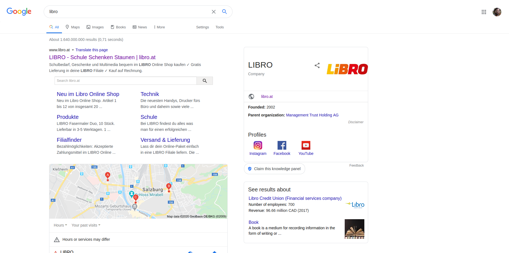

# Web search usage

Notes:

---

# User intents

<!-- .slide: class="audience-question" -->

Change search result page depending on intent

* Informational: Find information <!-- .element: class="fragment" data-fragment-index="" -->
* Navigational: Find homepage <!-- .element: class="fragment" data-fragment-index="" -->
* Transactional: Find product <!-- .element: class="fragment" data-fragment-index="" -->
* Local: Find place <!-- .element: class="fragment" data-fragment-index="" -->

Notes:

* What are the four most important types of web search queries?

---

# Informational queries

<!-- .slide: class="audience-question" -->

## Know

Majority of search traffic

* "computer science" <!-- .element: class="fragment" data-fragment-index="" -->
* "salzburg sights" <!-- .element: class="fragment" data-fragment-index="" -->
* "lolcats" <!-- .element: class="fragment" data-fragment-index="" -->

Notes:

* Examples?

---

# Informational queries

<!-- .slide: class="audience-question" -->

## Know simple

Clear facts

* "how old is arnold schwarzenegger" <!-- .element: class="fragment" data-fragment-index="" -->
* "5 usd in eur" <!-- .element: class="fragment" data-fragment-index="" -->
* "capitol of austria" <!-- .element: class="fragment" data-fragment-index="" -->

Notes:

* Examples?

---

Notes:

---

Notes:

---

# Navigational queries

<!-- .slide: class="audience-question" -->

## Go

* "fh salzburg homepage" <!-- .element: class="fragment" data-fragment-index="" -->
* "youtube" <!-- .element: class="fragment" data-fragment-index="" -->
* "apple.com" <!-- .element: class="fragment" data-fragment-index="" -->

Notes:

* Examples?

---

# Transactional queries

<!-- .slide: class="audience-question" -->

## Do

* "buy iphone 7" <!-- .element: class="fragment" data-fragment-index="" -->
* "flight to salzburg" <!-- .element: class="fragment" data-fragment-index="" -->
* "sign up for newsletter" <!-- .element: class="fragment" data-fragment-index="" -->

Notes:

* Examples?

---

Notes:

---

Notes:

---

Notes:

---

# Local queries

<!-- .slide: class="audience-question" -->

## Visit-in-person

* "pizza place" <!-- .element: class="fragment" data-fragment-index="" -->
* "bike repair" <!-- .element: class="fragment" data-fragment-index="" -->
* "fh salzburg" <!-- .element: class="fragment" data-fragment-index="" -->

Notes:

* Examples?

---

Notes:

---

Notes:

---

# Interpretation

<!-- .slide: class="audience-question" -->

Often ambiguous and subjective

* "iphone"<!-- .element: class="fragment" -->
    * Informational or transactional?<!-- .element: class="fragment" -->
* "libro"<!-- .element: class="fragment" -->
    * Navigational or visit-in-person?<!-- .element: class="fragment" -->

Notes:

* Name examples of ambiguous queries.
* Which intents can be applied to the example queries?

---

Notes:

---

# But wait, there's more

[Google Search Quality Evaluator Guidelines](https://www.google.com/insidesearch/howsearchworks/assets/searchqualityevaluatorguidelines.pdf)

Notes:
