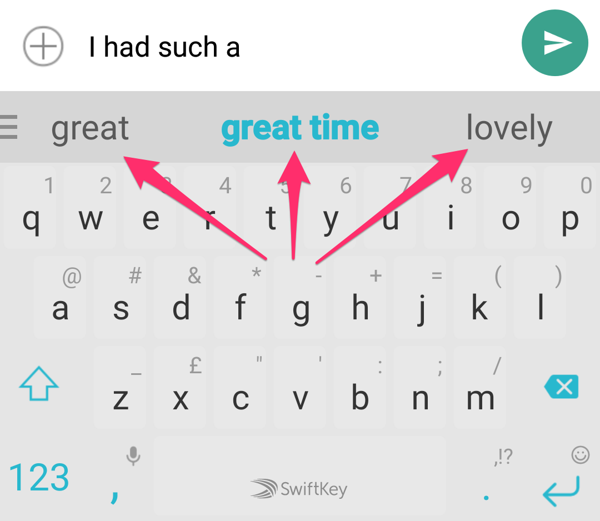
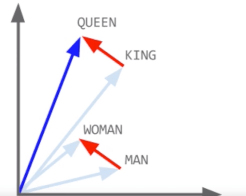
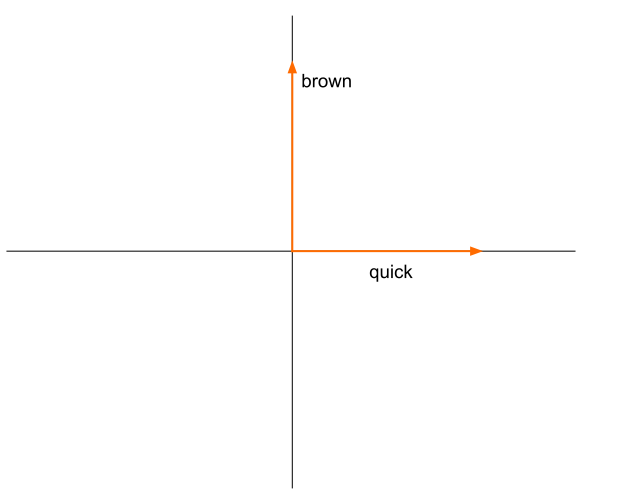
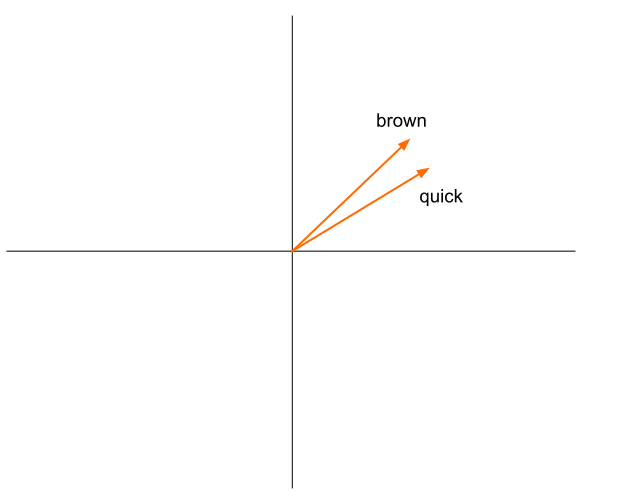

# Word Embedding

Notes:
---

# Prediction

&shy;<!-- .element: class="stretch" -->

Notes:
---

# Similarity

$$\text{king} - \text{man} + \text{woman} \approx \text{queen}$$

Notes:
---

# Word Embedding

* Use vectors to represent words
* Embed in multi-dimensional space

$$\text{Similar vectors} \approx \text{Related words} \approx \text{Occur in similar contexts}$$

Notes:
---

# Words as vectors

* **Corpus**: *The quick brown fox jumps over the lazy dog.*
* **Vocabulary**: [quick, brown, fox, jump, lazy, dog].
* **Vector for** *brown* (one-hot encoding):

| Word  | Vector |
|-------|--------|
| quick | 0      |
| brown | 1      |
| fox   | 0      |
| jump  | 0      |
| lazy  | 0      |
| dog   | 0      |

<!-- .element: class="fragment" -->

Notes:
What does the vector for brown look like?
---

# Vectors are unrelated

&shy;<!-- .element: class="stretch" --><!-- .element: style="border: none; box-shadow: none" -->

Notes:
---

# Embed word vectors

&shy;<!-- .element: class="stretch" --><!-- .element: style="border: none; box-shadow: none" -->

Notes:
---

# Train similarity

    \begin{aligned}
    sim(\text{quick}, \text{brown}) &> sim(\text{quick}, \text{dog})\\\\
    sim(\begin{pmatrix}1 \\\\ 0 \\\\ 0 \\\\ 0 \\\\ 0 \\\\ 0\end{pmatrix}, \begin{pmatrix}0 \\\\ 1 \\\\ 0 \\\\ 0 \\\\ 0 \\\\ 0\end{pmatrix}) &> sim(\begin{pmatrix}1 \\\\ 0 \\\\ 0 \\\\ 0 \\\\ 0 \\\\ 0\end{pmatrix}, \begin{pmatrix}0 \\\\ 0 \\\\ 0 \\\\ 0 \\\\ 0 \\\\ 1\end{pmatrix})
    \end{aligned}

Notes:
---

# Training data

*The quick brown fox jumps over the lazy dog.*

Slide window over corpus:

1. &shy;<!-- .element: class="fragment" data-fragment-index="1" -->
   *The quick brown fox jumps over the lazy dog*
    * [*the* &rarr; *quick*]
2. &shy;<!-- .element: class="fragment" --> *The quick
   brown fox jumps over the lazy dog*
    * [*quick* &rarr; *brown*]
3. &shy;<!-- .element: class="fragment" --> *The quick 
   brown fox jumps over the lazy dog*
    * [*brown* &rarr; *fox*]

&shy;<!-- .element: class="fragment" -->When Machine sees *brown* it should predict *fox*.

Notes:
---

# Skipgram

Predict context from word.

1. *The <u>quick</u> brown brown fox jumps over the lazy dog*: [*quick* &rarr; *the*,
   *brown*]
2. *The quick <u>brown</u> fox jumps over the lazy dog*: [*brown* &rarr; *quick*,
   *fox*]
3. *The quick brown <u>fox</u> jumps over the lazy dog*: [*fox* &rarr; *brown*,
   *jumps*]

When Machine sees *quick* it should predict *the* or *brown*.

Window can be larger (recommended: 5).

Skipgram well suited for small data sets with rare words.

Notes:
---

# Continuous Bag of Words (CBOW)

Predict word from context.

1. *<u>The</u> quick <u>brown</u> brown fox jumps over the lazy dog*: [*the*,
   *brown* &rarr; *quick*]
2. *The <u>quick</u> brown <u>fox</u> jumps over the lazy dog*: [*quick*, *fox* &rarr;
   *brown*]
3. *The quick <u>brown</u> fox <u>jumps</u> over the lazy dog*: [*brown*,
   *jumps* &rarr; *fox*]

When Machine sees *the* or *brown* it should predict *quick*.

CBOW trains faster, more accurate for frequent words.

Notes:
---

# Word Embedding visualized

[Word Embedding Visual Inspector](https://ronxin.github.io/wevi/)

Notes:
---

# Word Embedding play time

[View Word Embedding Notebook](https://github.com/georgms/information-retrieval/blob/gh-pages/word-embedding/Word%20Embedding.ipynb)

1. Download [Word Embedding Notebook](word-embedding/Word_Embedding.ipynb) and [data.txt](word-embedding/data.txt)
2. Run Jupyter: `docker run -p 8888:8888 -e GRANT_SUDO=yes -u root jupyterhub/singleuser`
3. Open http://localhost:8888/lab with the token from the console
4. Upload Notebook and `data.txt`

Notes:
---

# Word2Vec Alternatives

[fastText](https://fasttext.cc/)

* Uses n-grams instead of words
* Can match unknown words by matching n-grams
* Can also be used for text classification
* Pre-trained for many languages

[GloVe](https://nlp.stanford.edu/projects/glove/)

* Pre-trained for many languages

Notes:
