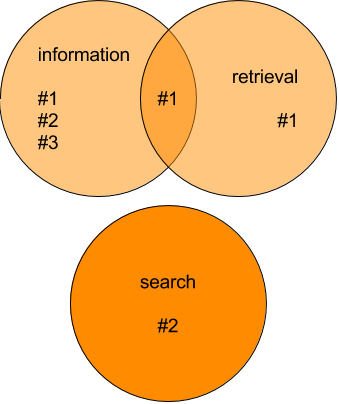

# Boolean retrieval

`AND`, `OR`, `NOT`
---
Find all **documents** containing the **terms** and satisfying the conditions:

```
fh AND salzburg
```

```
mmt OR mma
```

```
mmt AND NOT mma
```

```
(information AND retrieval) OR search
```
---
# Nomenclature

## Documents <!-- .element: class="fragment" data-fragment-index="1" -->

<span class="fragment" data-fragment-index="1">Books, chapters, pages, web pages, news posts...</span>

## Document collection, Corpus <!-- .element: class="fragment" data-fragment-index="2" -->

<span class="fragment" data-fragment-index="2">All the documents</span>

## Terms <!-- .element: class="fragment" data-fragment-index="3" -->

<span class="fragment" data-fragment-index="3">Like words, but maybe _FH Salzburg_ and _A1_ as well</span>
---
# Will it match?

```
(information AND retrieval) OR search
```

* &shy;<!-- .element: class="fragment" --> \#1: _a book about information retrieval_ <span>&rarr;
  Match</span><!-- .element: class="fragment" style="color: green;" -->
* &shy;<!-- .element: class="fragment" --> \#2: _a book about the search for information_ <span>&rarr;
  Match</span><!-- .element: class="fragment" style="color: green;" -->
* &shy;   <!-- .element: class="fragment" --> \#3: _a book about information_ <span>&rarr; No
  Match</span><!-- .element: class="fragment" style="color: red;" -->

Notes:
Audience question
---
# Nomenclature

## Information need <!-- .element: class="fragment" data-fragment-index="1" -->
What the user is looking for: <!-- .element: class="fragment" data-fragment-index="1" -->

_I want to learn about information retrieval and search_ <!-- .element: class="fragment" data-fragment-index="2" -->

## Query <!-- .element: class="fragment" data-fragment-index="3" -->
How the user talks to the computer: <!-- .element: class="fragment" data-fragment-index="3" -->

`(information AND retrieval) OR search` <!-- .element: class="fragment" data-fragment-index="4" -->

Notes:
If no special syntax for query is required than it is easier to express information need.
See semantic search, voice etc.
---
# Simple Boolean Retrieval Implementation

1. Calculate result lists for every query term: Grep
2. Apply boolean operators: Intersect, Union
---
# Grep

* Query term : *book*
* Document string: *a book about information retrieval*

Compare query term with document string, from first to last character

1. <!-- .element: class="fragment fade-in-then-out" data-fragment-index="1" --><span>a␣bo</span><!-- .element: class="fragment highlight-blue" data-fragment-index="1" -->ok about information retrieval
2. <!-- .element: class="fragment fade-in-then-out" data-fragment-index="2" -->a<span>␣boo</span><!-- .element: class="fragment highlight-blue" data-fragment-index="2" -->k about information retrieval
3. <!-- .element: class="fragment" data-fragment-index="3" -->a <span>book</span><!-- .element: class="fragment highlight-blue" data-fragment-index="3" --> about information retrieval <span>&rarr; Match</span><!-- .element: class="fragment" style="color: green;" -->

Notes:
Audience question
---
# Generate result lists

## For every query term…

```
(information AND retrieval) OR search
```

&darr;

1. *information*
2. *retrieval*
3. *search*

## …in every document

1. *a book about information retrieval*
2. *a book about the search for information*
3. *a book about retrieving information*

Notes:
---
# Generate result lists

**Query term: *information*** &rarr; <span>[#1, #2, #3]</span><!-- .element: class="fragment" data-fragment-index="1" -->

* #1 *a book about information retrieval*
* #2 *a book about the search for information*
* #3 *a book about retrieving information*

**Query term: *retrieval*** &rarr; <span>[#1]</span><!-- .element: class="fragment" data-fragment-index="2" -->

* #1 *a book about information retrieval*
* #2 *a book about the search for information*
* #3 *a book about retrieving information*

**Query term: *search*** &rarr; <span>[#2]</span><!-- .element: class="fragment" data-fragment-index="3" -->

* #1 *a book about information retrieval*
* #2 *a book about the search for information*
* #3 *a book about retrieving information*

Notes:
Audience question
---
# Intersect / Union

* &shy;<!-- .element: class="fragment" data-fragment-index="1" --> \#1: _a book about information retrieval_
* &shy;<!-- .element: class="fragment" data-fragment-index="1" --> \#2: _a book about the search for information_
* &shy;<!-- .element: class="fragment" data-fragment-index="1" --> \#3: _a book about retrieving information_

```
(information AND retrieval) OR search
```
<!-- .element: class="fragment" data-fragment-index="1" -->

 <!-- .element: class="fragment" data-fragment-index="2" -->

Notes:
Audience question
---
# Complexity

* [Big &Omicron; notation](https://en.wikipedia.org/wiki/Big_O_notation)
* Describe time or memory complexity of algorithms and data structures
* Which inputs influence their runtime and memory requirements?
* Look at worst case
---
# Time complexity examples

*How many loops do you need?*

| Big &Omicron; | Name      | Example                           | Explanation                                   |
|---------------|-----------|-----------------------------------|-----------------------------------------------|
| Ο(1)          | Constant  | Odd or even number?               | No loop                                       |
| Ο(n)          | Linear    | Calculate array sum               | Iterate over all values                       |
| Ο(n²)         | Quadratic | Find duplicates in unsorted array | Compare every value against every other value |
---
# Complexity

## Grep

Search every query term as a string in every document: <!-- .element: class="fragment" -->

&Omicron;(num query terms &times; total length of all documents) <!-- .element: class="fragment" -->

## Union

Merge result lists (without duplicates): <!-- .element: class="fragment" -->

&Omicron;(number of results) <!-- .element: class="fragment" -->

## Intersect

Compare every result from one list with every result from the other: <!-- .element: class="fragment" -->

&Omicron;(number of results) <!-- .element: class="fragment" -->

Notes:
Audience question
---
# Grep complexity

* &Omicron;(num query terms &times; total length of all documents)
* Can take reaaally long

## <!-- .element: class="fragment" data-fragment-index="1" --> Example

* &shy;<!-- .element: class="fragment" data-fragment-index="1" -->*English Wikipedia*: 6M articles, 12B characters, 1.2M
  distinct terms
* &shy;<!-- .element: class="fragment" data-fragment-index="1" -->grep: 2 query terms &times; 12GB = **24 billion string
  comparisons**

Notes:
How can this be improved?
---
# Grep disadvantages

* &shy;<!-- .element: class="fragment" -->   Does _books_ match _book_?
  * &shy;<!-- .element: class="fragment" -->Cannot deal with singular / plural, *books* does not match *book*.
* &shy;<!-- .element: class="fragment" --> _go_ vs _went_
* &shy;<!-- .element: class="fragment" --> _running_ vs _run_
* &shy;<!-- .element: class="fragment" --> _go_ vs _gong_

Not user friendly!<!-- .element: class="fragment" -->

Notes:
More examples?
