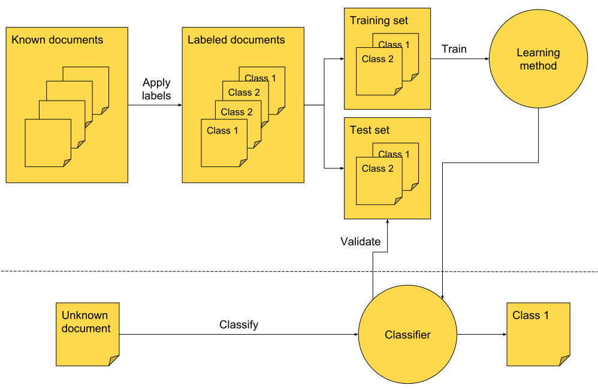

# Text Classification

## Supervised Learning

Notes:
---

# What?

* Assign document to class(es)
* Based on document features:
    * Contents
    * Age
    * Popularity
    * …

Notes:

* What are use cases?

---

# Why?

* Standing queries (Google Alerts)
* Spam filter
* Webspam detection
* Language detection
* Sentiment detection

Notes:
---

# How?

* Make humans do it<!-- .element: class="fragment" data-fragment-index="1" -->
    * Needs domain experts<!-- .element: class="fragment" data-fragment-index="1" -->
    * Does not scale with amount of data<!-- .element: class="fragment" data-fragment-index="1" -->
* Make machines do it<!-- .element: class="fragment" data-fragment-index="2" -->
    * Needs lots of data<!-- .element: class="fragment" data-fragment-index="2" -->

Notes:

* How?
* What's the issue with humans doing it?

---

# Supervised learning

<!-- .element: style="border: none; box-shadow: none;" -->

Notes:
---

# Supervised Learning Example

<!-- .element: style="border: none; box-shadow: none;" -->

Notes:
---

# Nomenclature

## Learning Method

Computes classifier

## Classifier

Determines class of document
---

# Class membership

| Type              | Example                                            |
|-------------------|----------------------------------------------------|
| Single / one-of   | Spam<!-- .element: class="fragment" -->            |
| Multiple / any-of | Blog categories<!-- .element: class="fragment" --> |

# Classifiers

| Type        | Example                                              |
|-------------|------------------------------------------------------|
| One class   | Spam <!-- .element: class="fragment" -->             |
| Two class   | Sentiment <!-- .element: class="fragment" -->        |
| Multi class | Blog categories  <!-- .element: class="fragment" --> |

Notes:
Examples?
