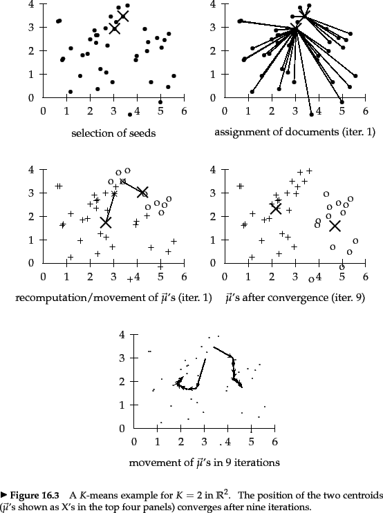

# Clustering

Notes:
---

# What?

* Classes are not known
* Assign similar documents to same class / cluster

Notes:
---

# Why?

* Show similar documents<!-- .element: class="fragment" data-fragment-index="1" -->
* Cluster search results<!-- .element: class="fragment" data-fragment-index="1" -->
* Exploratory browsing<!-- .element: class="fragment" data-fragment-index="1" -->
* News aggregation<!-- .element: class="fragment" data-fragment-index="1" -->

Notes:
Why?
---

# How?

* Unsupervised learning
* No labeled documents available

Notes:
---

# Types of clustering

* *Hard*: Document belongs to exactly one cluster
* *Soft*: Document can belong to multiple clusters with varying degrees
* *Flat*: One level of clusters
* *Hierarchical*: Sub-clusters

Notes:
---

# K-Means

1. Set $K$ random centroids
2. Assign each document to nearest centroid
3. Move centroids to minimize distance to documents
4. Terminate or goto 2

Notes:
---

<!-- .element: style="border: none; box-shadow: none;" -->

© 2008 Cambridge University Press<!-- .element: style="font-size: x-small" -->

Notes:
---

# Termination

* Centroids do not move<!-- .element: class="fragment" data-fragment-index="1" -->
* Assignment do not change<!-- .element: class="fragment" data-fragment-index="1" -->
* Sum of distances does not decrease<!-- .element: class="fragment" data-fragment-index="1" -->
* Sum of distances is below threshold<!-- .element: class="fragment" data-fragment-index="1" -->
* After $n$ iterations<!-- .element: class="fragment" data-fragment-index="1" -->

Notes:
---

# K-Means disadvantages

* Can get stuck on local minimum
* Can build singleton clusters for outliers
* Can build empty clusters

Notes:
