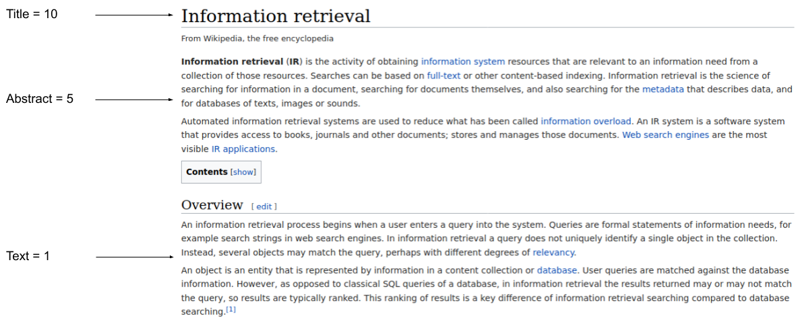

# Use document structure for ranking

Notes:
How can we exploit the document structure to improve ranking? Think of a typical Wikipedia article.
---
# Document structure

Notes:
How can we exploit this information for ranking purposes?
---
# Field weights

Notes:
How can we determine the field weights?
---
# Index with Fields

| Doc | Author          | Title                                                    |
|-----|-----------------|----------------------------------------------------------|
| #1  | Arthur McAuthor | A book providing information about information retrieval |
| #2  | Shakesbeer      | A book about the search for King Arthur                  |

***

| Term        | Doc IDs                                                |
|-------------|--------------------------------------------------------|
| arthur      | #1:Author, #2:Title<!-- .element: class="fragment" --> |
| book        | #1:Title, #2:Title<!-- .element: class="fragment" -->  |
| information | #1:Title<!-- .element: class="fragment" -->            |
| mcauthor    | #1:Author<!-- .element: class="fragment" -->           |
| shakesbeer  | #2:Author<!-- .element: class="fragment" -->           |
| ...         |

Notes:
Audience question
---
# Field weights

| Term                                                                                                                                                         | Doc IDs                                                                                                                                                                   |
|--------------------------------------------------------------------------------------------------------------------------------------------------------------|---------------------------------------------------------------------------------------------------------------------------------------------------------------------------|
| arthur | #1:Author, #2:Title |
| book   | #1:Title, #2:Title  |
| ...                                                                                                                                                          |

***

* `weight(author) = 10`
* `weight(title) = 1`

***

* <!-- .element: class="fragment" data-fragment-index="1" --> `arthur book`?
* \#1 &rarr; <!-- .element: class="fragment" data-fragment-index="2" --> author + title = 10 + 1 = **11**
* \#2 &rarr; <!-- .element: class="fragment" data-fragment-index="4" --> title + title = 1 + 1 = **2**

Notes:
* Audience question
---
# Field weights

* Determining weights is hard
* Use annotated corpus and machine learning

Notes:
What else can be done with field info? -> Field queries!
---
# Field queries

| Term       | Doc IDs             |
|------------|---------------------|
| arthur     | #1:Author, #2:Title |
| shakesbeer | #2:Author           |
| ...        |

***

* <!-- .element: class="fragment" --> `title:arthur`?
    * <!-- .element: class="fragment" --> #2
* <!-- .element: class="fragment" --> `author:shakesbeer`?
    * <!-- .element: class="fragment" --> #2

Notes:
* Audience question
