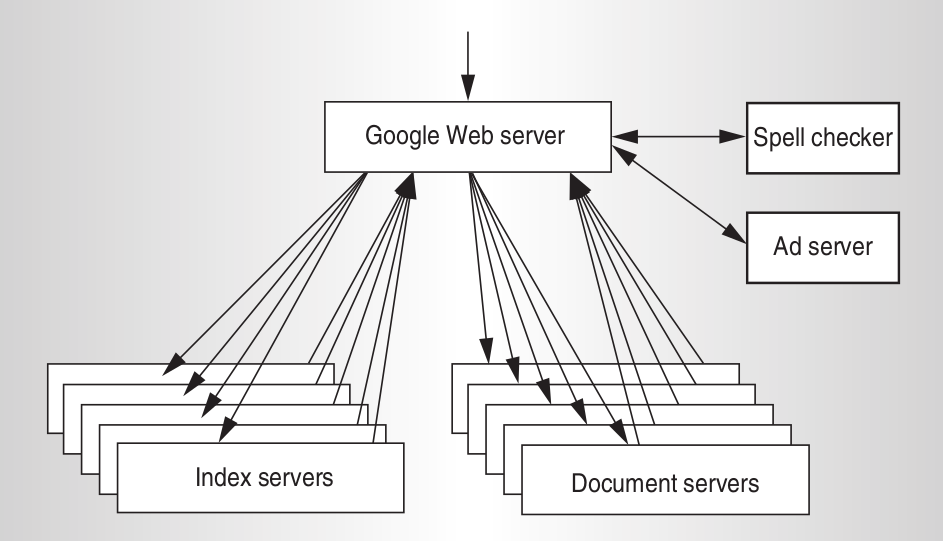

# What would Google do?

[Web search for a planet: The Google cluster architecture (2003)](https://static.googleusercontent.com/media/research.google.com/de//archive/googlecluster-ieee.pdf)<!-- .element: target="_blank" -->
---

# Basic assumptions

* Search can be parallelized
* High-end hardware fails too
* Throughput > performance
* Queries per second > Seconds per query

&darr;

* Rely on software, not hardware
* Use commodity hardware

---

# Parallelize

* Focus on parallel queries
* Achieve high throughput
* Parallelize at CPU or Cluster level
* 10s query parallelized on 10 nodes takes 1s

Notes:
---

# Query time

[Source](https://static.googleusercontent.com/media/research.google.com/de//archive/googlecluster-ieee.pdf) <!-- .element: style="font-size: smaller;" target="_blank" -->

* Index servers: Inverted Index, document-partitioned
* Document servers: Copy of entire internet

Notes:

---

# Query time

1. Query index servers &rarr; doc IDs
2. Merge doc IDs &rarr; result set
3. Fetch doc IDs from doc servers &rarr; (Title, URL, result snippet)
4. Generate search result page

Notes:
