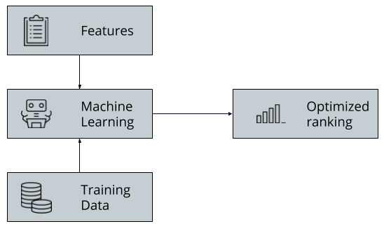

# Calculate Weights
---
TODO: Make it easier to create stretch images

<!-- .element: style="border: none; box-shadow: none;" -->

Notes:
---
<!-- .element: style="border: none; box-shadow: none;" -->

Ideal Rank vs. Actual Rank

Notes:
---

# Machine Learning

* RankSVM
* PRanking
* LambdaMART
* GBRT
* …

Notes:
---

# Obtain result clicks

| Query  | Document<!-- .element: class="fragment" data-fragment-index="1" -->     | Current Rank<!-- .element: class="fragment" data-fragment-index="2" --> | | Clicks<!-- .element: class="fragment" data-fragment-index="3" -->            |
|--------|-------------------------------------------------------------------------|-------------------------------------------------------------------------|-|------------------------------------------------------------------------------|
| iphone | iPhone cover<!-- .element: class="fragment" data-fragment-index="1" --> | 1<!-- .element: class="fragment" data-fragment-index="2" -->            | | 2<!-- .element: class="fragment" data-fragment-index="3" -->                 |
| iphone | iPhone X<!-- .element: class="fragment" data-fragment-index="1" -->     | 2<!-- .element: class="fragment" data-fragment-index="2" -->            | | 11<!-- .element: class="fragment" data-fragment-index="3" -->                |
| iphone | iPhone 8<!-- .element: class="fragment" data-fragment-index="1" -->     | 3<!-- .element: class="fragment" data-fragment-index="2" -->            | | 5<!-- .element: class="fragment" data-fragment-index="3" -->                 |
| iphone | iPhone 13<!-- .element: class="fragment" data-fragment-index="1" -->    | 4<!-- .element: class="fragment" data-fragment-index="2" -->            | | 0 (just released)<!-- .element: class="fragment" data-fragment-index="3" --> |

Or use manual relevance judgement<!-- .element: class="fragment" data-fragment-index="5" -->

Ideal ranking:<!-- .element: class="fragment" data-fragment-index="6" -->

1. iPhone X<!-- .element: class="fragment" data-fragment-index="6" -->
2. iPhone 8<!-- .element: class="fragment" data-fragment-index="6" -->
3. iPhone cover<!-- .element: class="fragment" data-fragment-index="6" -->

<span class="fragment" data-fragment-index="7">How to rank _iPhone 13_?</span>

Notes:

What's the optimal ranking?
---

# Features

Must be numeric

* Keyword / field relevance, using TF-IDF<!-- .element: class="fragment" data-fragment-index="" -->
    * Query: *iphone*, title: *iPhone X* &rarr; 1
    * Query: *iphone*, title: *iPhone cover* &rarr; 1
    * Query: *iphone*, title: *Samsung Galaxy* &rarr; 0
* Other attributes<!-- .element: class="fragment" data-fragment-index="" -->
    * Product age: 5 years
    * Number of sales: 3.265
    * Price: 1.300€

Notes:
---

# Defining features

* Requires human effort and creativity
* Machine will figure importance of each feature

Notes:
---

# Calculate weights

$$f(\text{query}, \text{document features}, \text{feature weights}) = \text{ideal rank}$$

### Solve for _weights_

<!-- .element: class="fragment" data-fragment-index="1" --> 

$$\begin{aligned}
&f(\text{iphone}, \text{iPhone 8}, \text{weights}) &= 2\\\\
&f(\text{iphone}, \text{iPhone X}, \text{weights}) &= 1\\\\
&f(\text{iphone}, \text{iPhone cover}, \text{weights}) &= 3\\\\
\end{aligned}$$
<!-- .element: class="fragment" data-fragment-index="1" -->

Notes:
---

# Feature Store

TODO: Adapt for Elasticsearch

```json
[
  {
    "name": "documentRecency",
    "class": "org.apache.solr.ltr.feature.SolrFeature",
    "params": {
      "q": "{!func}recip( ms(NOW,last_updated_dt), 3.16e-11, 1, 1)"
    },
    "store": "wikipedia"
  },
  {
    "name": "popularity",
    "class": "org.apache.solr.ltr.feature.FieldValueFeature",
    "params": {
      "field": "popularity_score_d"
    },
    "store": "wikipedia"
  },
  {
    "name": "totalScore",
    "class": "org.apache.solr.ltr.feature.SolrFeature",
    "params": {
      "q": "{!edismax qf=\"title_txt_en headings_txt_en categories_txts_en opening_text_txt_en text_txt_en\"}${text}"
    },
    "store": "wikipedia"
  },
  {
    "name": "titleScore",
    "class": "org.apache.solr.ltr.feature.SolrFeature",
    "params": {
      "q": "{!edismax qf=\"title_txt_en\"}${text}"
    },
    "store": "wikipedia"
  },
  {
    "name": "exactTitle",
    "class": "org.apache.solr.ltr.feature.SolrFeature",
    "params": {
      "q": "{!df=\"title_exact_s_lower\"}${text}"
    },
    "store": "wikipedia"
  }
]
```

Notes:
---

# Feature Extraction

Query: *iphone x*

```json
[
  {
    "title_txt_en": "IPhone X",
    "[features]": "documentRecency:0.94301736 popularity:1.2207552E-5 totalScore:22.804134 titleScore:17.452236 exactTitle:11.403795 headingsScore:0.0 categoriesScore:0.0 openingScore:22.804134 textScore:19.482597"
  },
  {
    "title_txt_en": "OS X Mountain Lion",
    "[features]": "documentRecency:0.59085584 popularity:3.140487E-6 totalScore:19.74273 titleScore:5.4706 exactTitle:0.0 headingsScore:0.0 categoriesScore:8.784399 openingScore:8.180487 textScore:17.705677"
  },
  {
    "title_txt_en": "IPhone",
    "[features]": "documentRecency:0.97925586 popularity:6.251065E-5 totalScore:16.994913 titleScore:12.235063 exactTitle:0.0 headingsScore:0.0 categoriesScore:0.0 openingScore:15.402786 textScore:15.681499"
  }
]
```

Notes:
---

| Rank | Query    | Title relevance | Age | More features … | Comment        |
|------|----------|-----------------|-----|-----------------|----------------|
| 2    | *iphone* | 1.3             | 0.9 | 1               | # iPhone 8     |
| 3    | *iphone* | 1.3             | 0.3 | 0               | # iPhone X     |
| 1    | *iphone* | 1.3             | 1.2 | 0               | # iPhone cover |
| ?    | *iphone* | 1.3             | 0.1 | 0               | # iPhone 13    |
| 3    | *galaxy* | 3.3             | 3.5 | 1               |                |
| 2    | *galaxy* | 1.0             | 1.1 | 1               |                |
| 1    | *galaxy* | 0.5             | 1.2 | 1               |                |

Notes:
---

# Re-Rank Formula

$$\begin{aligned}
5 &\times \text{title relevance}\\\\
\+ 3.1 &\times \text{body relevance}\\\\
\+ 4.3 &\times \text{product age}\\\\
\+ 2.2 &\times \text{number of sales}
\end{aligned}$$

Notes:
---

# Model Store

```json
{
  "documentRecency": 0.053789198,
  "popularity": 2.7602253E-5,
  "totalScore": 0.11210245
}
```

Notes:
