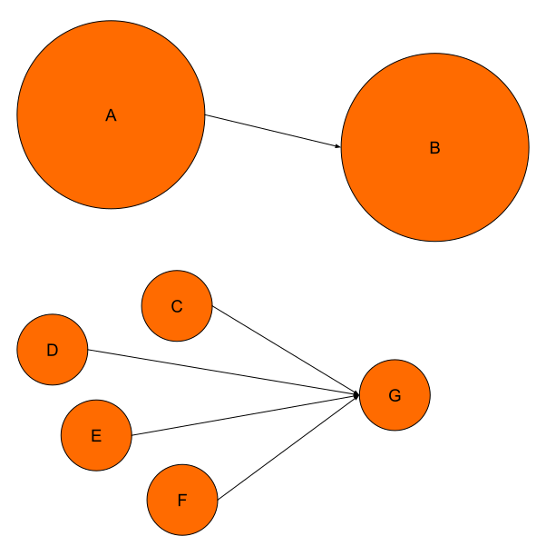

# Link analysis

Notes:
How to use link analysis to determine relevant pages?
---

# Assumption

* In-link = endorsement
* Similar to citation analysis

Notes:
---

# Link info

* Anchor text describes target page
    * "[computer manufacturer](http://lenovo.com)" &rarr; lenovo.com
* Also text surrounding links
    * "Find funny cat pics [here](http://icanhascheezburger.com)"
* May also be abused
    * "[evil empire](http://www.korea-dpr.com/)"

Notes:
---

# PageRank

* Rank pages with many in-links higher
* PageRank =~ In-degree
* But harder to influence as it propagates
* One in-link from high PageRank site worth more than many low PageRank in-link
* Probability that random surfer will end up on page

---

# PageRank vs In-Degree

<!-- .element: class="stretch" style="border: none; box-shadow: none; vertical-align: middle; width: 40%;" -->
---

# Pagerank calculation

1. Assume random surfer
2. Randomly walk web graph
    * No out-links &rarr; teleport
    * 15% chance that user opens a random page
3. Count how many times a page is visited

$$\sum \text{pagerank} = 1$$
---
[Pagerank visualization](https://d3og.com/emeeks/f448eef177b5fe94b1c0/)<!-- .element: target="_blank" -->

Notes:
---

# Reasonable surfer

* Clicks some links more often than others<!-- .element: class="fragment" -->
* Main content vs sidebar / footer<!-- .element: class="fragment" -->
* Anchor text related to query / user intent<!-- .element: class="fragment" -->
* Avoid ads<!-- .element: class="fragment" -->

Notes:
How can the random surfer be improved to provide more realistic results?
