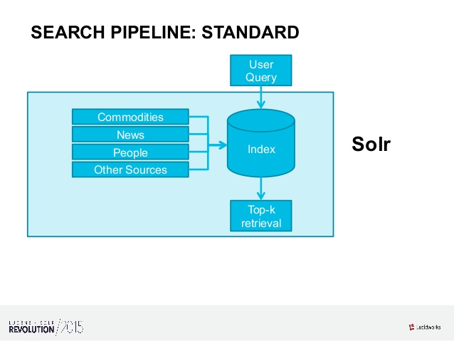
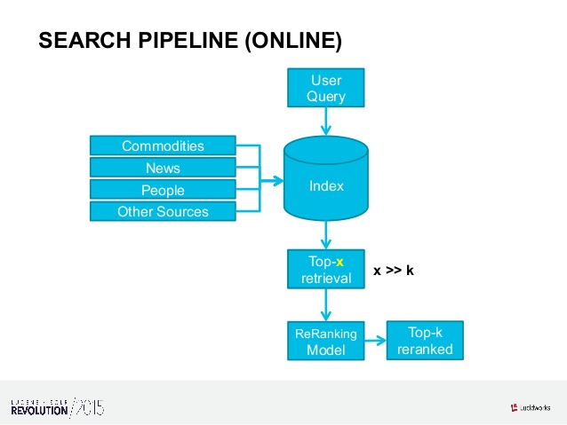

# Machine Learning for Ranked Retrieval

Notes:

---

# Why?

* Getting field weights right is hard
* Title match > Meta keyword match?
* Query "iphone": "iPhone cover" > "iPhone X"?

Just rank by click!<!-- .element: class="fragment" -->

But what about new items?<!-- .element: class="fragment" -->

Notes:

---

# How?

1. Calculate weights
2. Apply new weights
3. Compare actual rank to expected rank (nDCG, MAP, ERR, …)
4. Try harder

Notes:

---

# From

<!-- .element: style="border: none; box-shadow: none;" -->

Notes:

---

# To

<!-- .element: style="border: none; box-shadow: none;" -->

Notes:
