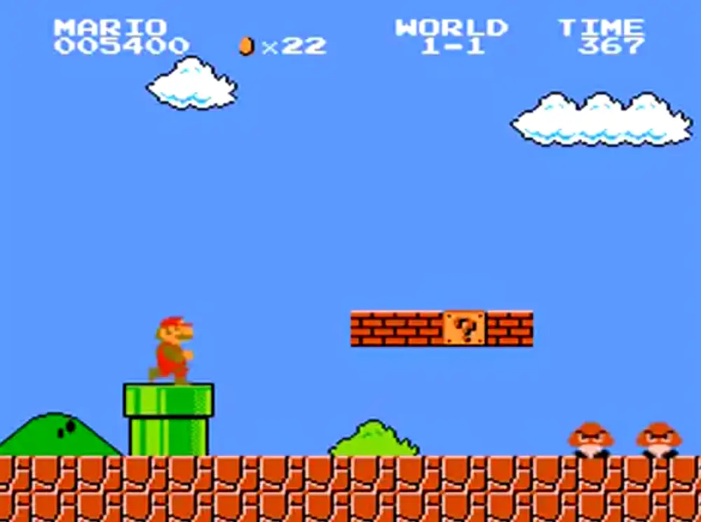

# Machine Learning
---

# Supervised Learning

###### Here are cats:

<!-- .element: height="100px" -->
<!-- .element: height="100px" -->
<!-- .element: height="100px" -->

###### Here are dogs:

<!-- .element: height="100px" -->
<!-- .element: height="100px" -->
<!-- .element: height="100px" -->

### Computer: Is this a cat or a dog?

<!-- .element: height="150px" -->
---

# Unsupervised learning

###### Here are pictures of animals:

<!-- .element: height="100px" -->
<!-- .element: height="100px" -->
<!-- .element: height="100px" -->
<!-- .element: height="100px" -->
<!-- .element: height="100px" -->
<!-- .element: height="100px" -->

### Computer: Group similar ones

###### Pointy ears:

<!-- .element: height="100px" -->
<!-- .element: height="100px" -->
<!-- .element: height="100px" -->

###### Floppy ears:

<!-- .element: height="100px" -->
<!-- .element: height="100px" -->
<!-- .element: height="100px" -->

Notes:
Computer has no concept of ear shapes, it just groups similar images together.
---

# Reinforcement Learning

<!-- .element: height="500px" -->
---

# Transfer Learning

###### I like this style

<!-- .element: height="200px" -->

###### Computer: Apply this style to a picture of a cat

<!-- .element: height="200px" -->

&shy;<!-- .element: style="font-size: small; color: grey" --> Source: https://discuss.pixls.us/t/style-transfer-soon-in-gmic/10009<!-- .element: target="_blank" -->
