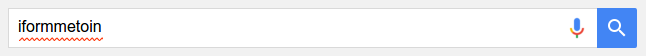
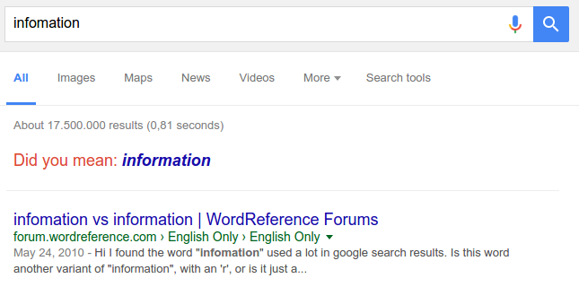
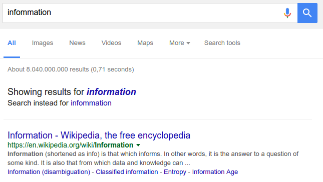
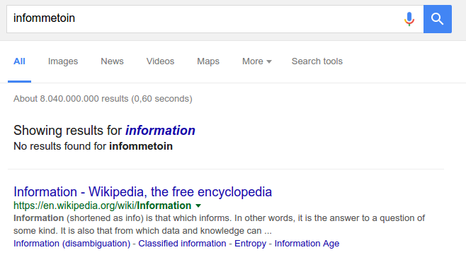

# Spelling correction

*Palystation, Xboy, Wiii*

Notes:
---
# Spelling correction

 <!-- .element: class="fragment" style="border: none;" -->

1. <!-- .element: class="fragment" --> Find alternatives
2. <!-- .element: class="fragment" --> Evaluate alternatives
3. <!-- .element: class="fragment" --> Return alternative results

Notes:
---
# 1. Find alternatives

&shy;<!-- .element: class="fragment" --> `bock`

&shy;<!-- .element: class="fragment" --> &darr;

&shy;<!-- .element: class="fragment" --> `book`, `rock`, `spock`

Notes:
How to find these alternatives in the index?
---
# Find alternatives

* Compare query with vocabulary
Notes:
---
# 1.a Levenshtein

* Edit distance between two words
* Count inserts, deletes, replaces, swaps

Notes:
---
# Levenshtein

|                                                                      |                                                       |
|----------------------------------------------------------------------|-------------------------------------------------------|
| iformmetoin~                                                         |                                                       |
| &shy;<!-- .element: class="fragment" --> 1. Add **n**                | &shy;<!-- .element: class="fragment" --> informmetoin |
| &shy;<!-- .element: class="fragment" --> 2. Delete **m**             | &shy;<!-- .element: class="fragment" --> informetoin  |
| &shy;<!-- .element: class="fragment" --> 3. Replace **e** with **a** | &shy;<!-- .element: class="fragment" --> informatoin  |
| &shy;<!-- .element: class="fragment" --> 4. Swap **o** and **i**     | &shy;<!-- .element: class="fragment" --> information  |

&shy;<!-- .element: class="fragment" --> Levenshtein distance = 4

Notes:
* Audience question
---
# Levenshtein

* Weighted (keyboard distance)

Notes:
---
# Levenshtein

* Expensive: Cannot be precomputed\*
* `num(query terms) × num(vocabulary terms)`

\*Except with some highly complex finite state machines
Notes:
---
# 2. Evaluate alternatives

Notes:
---
# Context

* &shy;<!-- .element: class="fragment" data-fragment-index="1" --> Find alternatives for every misspelled query term &rarr; *collations*
* &shy;<!-- .element: class="fragment" data-fragment-index="2" --> Search for collation and evaluate results

* &shy;<!-- .element: class="fragment" data-fragment-index="4" --> `seach endine`?
* &shy;<!-- .element: class="fragment" data-fragment-index="5" --> `seach` &rarr; `peach, search`
* &shy;<!-- .element: class="fragment" data-fragment-index="6" --> `endine` &rarr; `ending, engine`

* &shy;<!-- .element: class="fragment" data-fragment-index="8" --> `seach endine`?
* &shy;<!-- .element: class="fragment" data-fragment-index="9" --> &rarr; `peach engine`? 0 results
* &shy;<!-- .element: class="fragment" data-fragment-index="10" --> &rarr; `peach ending`? 0 results
* &shy;<!-- .element: class="fragment" data-fragment-index="11" -->&rarr; `search ending`
    <!-- .element: class="fragment highlight-current-blue" data-fragment-index="13" --> ? 5 results
* &shy;<!-- .element: class="fragment" data-fragment-index="12" -->&rarr; `search engine`
    <!-- .element: class="fragment highlight-current-blue" data-fragment-index="13" --> ? 10 results

Notes:
Which correction is the best? Why? What metrics could be applied?
---
# Evaluate alternatives

* &shy;<!-- .element: class="fragment" --> Most results
* &shy;<!-- .element: class="fragment" --> Best results
* &shy;<!-- .element: class="fragment" --> Most searched

Notes:
If multiple alternatives with results, how to pick the best one?
---
# 3. Return alternative results

* Feedback
* Transparency

Notes:
* How does this affect precision and recall?
* What kind of spelling corrections does Google offer? What are the three typical scenarios?
---
# Did you mean

* Original query has decent results
* There is a better alternative

Notes:
---
# Instead

* Original query has poor results
* There is a better alternative

Notes:
---
# Showing results for

* Original query has no results
* There is an alternative

Notes:
