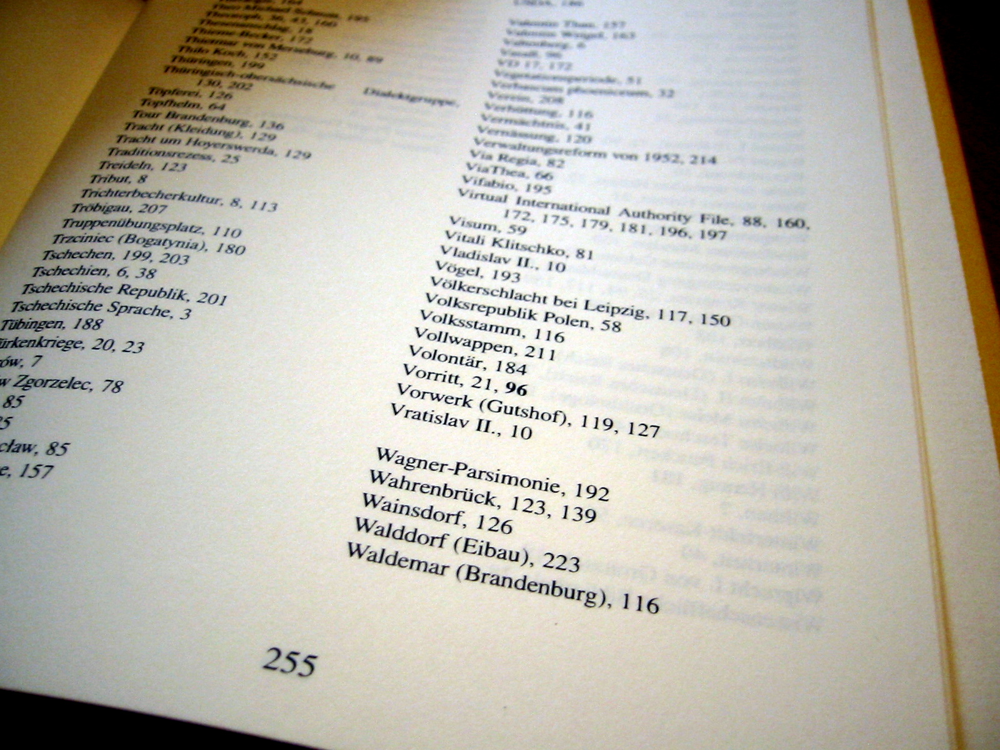

# Term-document Matrix

Reduce time complexity of `grep` operation

* Aka _incidence matrix_
* Rows: Distinct query terms
* Columns: Documents
* Fields: If term in doc 1, else 0
* Documents need to be pre-processed
---
* \#1: _a book about information retrieval_
* \#2: _a book about the search for information_
* \#3: _a book about information_

***

|                 | #1                                                           | #2                                                           | #3                                                            |
|-----------------|--------------------------------------------------------------|--------------------------------------------------------------|---------------------------------------------------------------|
| **Book**        | 1<!-- .element: class="fragment" data-fragment-index="1" --> | 1<!-- .element: class="fragment" data-fragment-index="5" --> | 1<!-- .element: class="fragment" data-fragment-index="9" -->  |
| **Information** | 1<!-- .element: class="fragment" data-fragment-index="2" --> | 1<!-- .element: class="fragment" data-fragment-index="6" --> | 1<!-- .element: class="fragment" data-fragment-index="10" --> |
| **Retrieval**   | 1<!-- .element: class="fragment" data-fragment-index="3" --> | 0<!-- .element: class="fragment" data-fragment-index="7" --> | 0<!-- .element: class="fragment" data-fragment-index="11" --> |
| **Search**      | 0<!-- .element: class="fragment" data-fragment-index="4" --> | 1<!-- .element: class="fragment" data-fragment-index="8" --> | 0<!-- .element: class="fragment" data-fragment-index="12" --> |

Notes:
Audience question
---
|             | #1 | #2 | #3 |
|-------------|----|----|----|
| Book        | 1  | 1  | 1  |
| Information | 1  | 1  | 1  |
| Retrieval   | 1  | 0  | 0  |
| Search      | 0  | 1  | 0  |

***

* Document vector
    * &shy;<!-- .element: class="fragment" --> \#1: `(1, 1, 1, 0)`
* Term vector
    * &shy;<!-- .element: class="fragment" --> _Retrieval_: `(1, 0, 0)`

Notes:
Audience question
---
# How to query

Replace every term in query with term vector

* (information AND retrieval) OR search
* = (111 &and; 100) &or; 010 <!-- .element: class="fragment" -->
* = 100 &or; 010 <!-- .element: class="fragment" -->
* = 110 <!-- .element: class="fragment" -->
* = \#1 and \#2 <!-- .element: class="fragment" -->
    * &shy;<!-- .element: class="fragment" --> \#1: _a book about information retrieval_
    * &shy;<!-- .element: class="fragment" --> \#2: _a book about the search for information_

Notes:
Audience question
---
#  Time complexity

&Omicron;(num query terms &times; num distinct terms)<!-- .element: class="fragment" data-fragment-index="1" -->

## <!-- .element: class="fragment" data-fragment-index="2" -->Example

* &shy;<!-- .element: class="fragment" data-fragment-index="2" -->*English Wikipedia*: 6M articles, 12B characters, 1.2M distinct terms
* &shy;<!-- .element: class="fragment" data-fragment-index="2" -->grep: 2 query terms &times; 12GB = **24 billion string comparisons**
* &shy;<!-- .element: class="fragment" data-fragment-index="3" -->Term-Document Matrix: 2 query terms &times; 1.2M distinct terms = **2.4M lookups**

Notes:
Audience question
---
# Size

num(distinct terms) &times; num(docs) bits<!-- .element: class="fragment" data-fragment-index="1" -->

## <!-- .element: class="fragment" data-fragment-index="2" -->Example

* &shy;<!-- .element: class="fragment" data-fragment-index="2" -->*English Wikipedia*: 6M articles, 12B characters, 1.2M distinct terms
* &shy;<!-- .element: class="fragment" data-fragment-index="2" -->1.2M distinct terms &times; 6M articles = 7.200.000.000.000 cells = 7.2 terrabit = **900 gigabyte**

That's way too large! How can the size be decreased?<!-- .element: class="fragment" data-fragment-index="2" -->

&darr;<!-- .element: class="fragment" data-fragment-index="4" -->

&shy;<!-- .element: class="fragment" data-fragment-index="4" -->Matrix is very sparse, has mostly zeros

Notes:
Audience question
---
&shy;<!-- .element: class="stretch" --> 

Notes:
