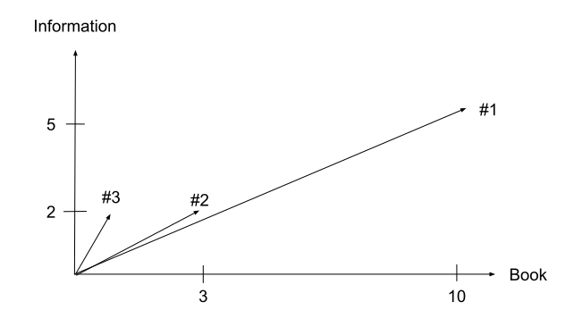
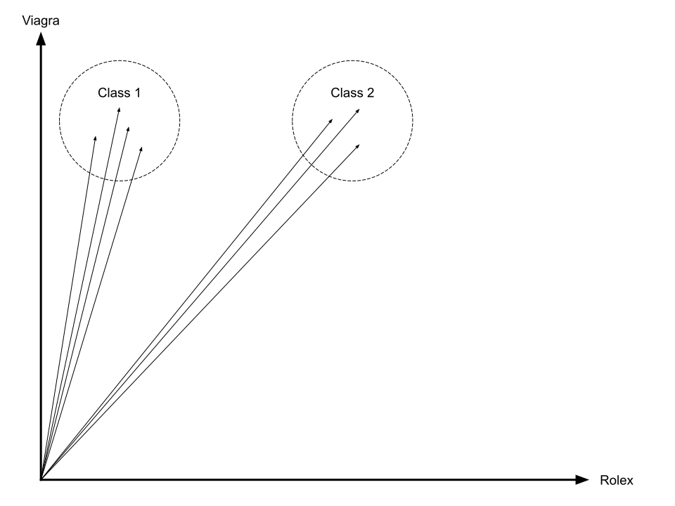
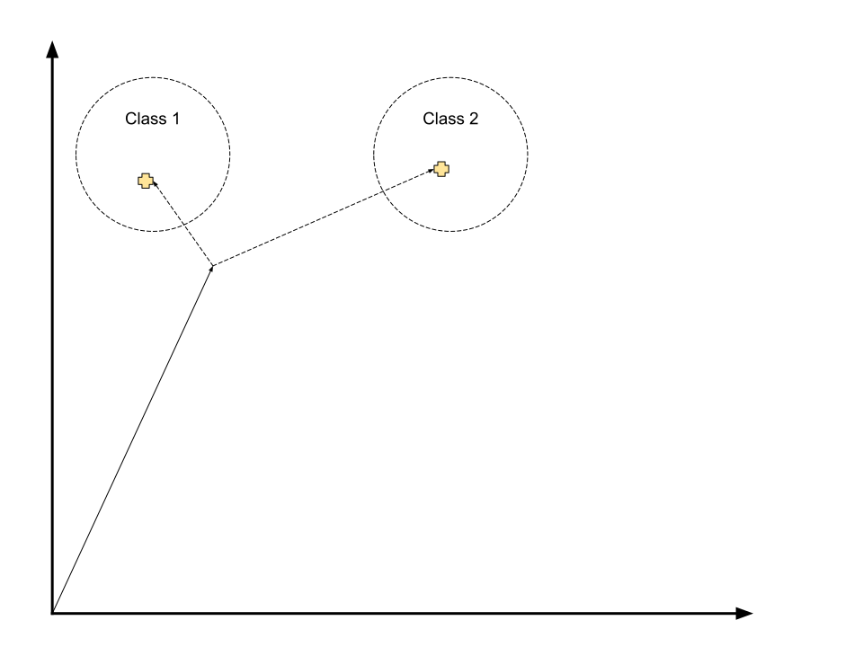
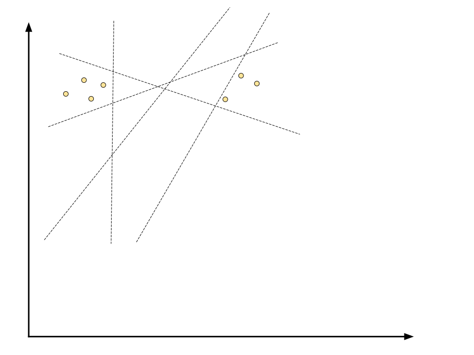
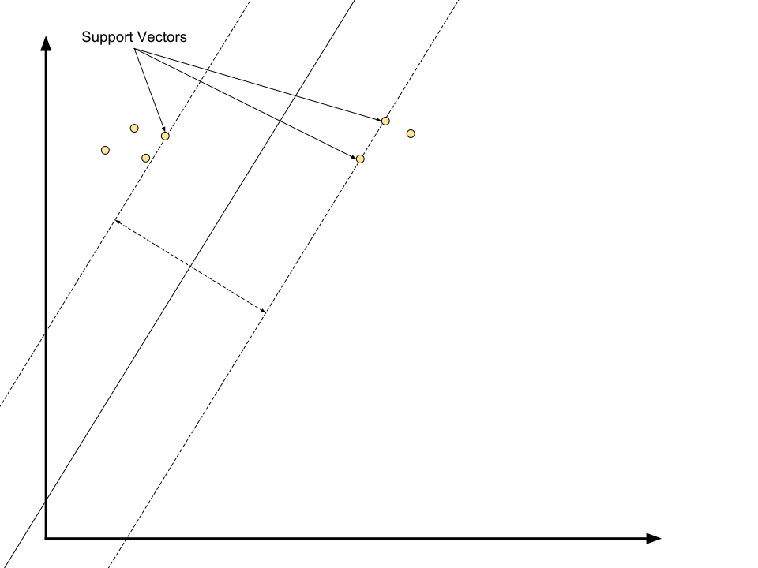
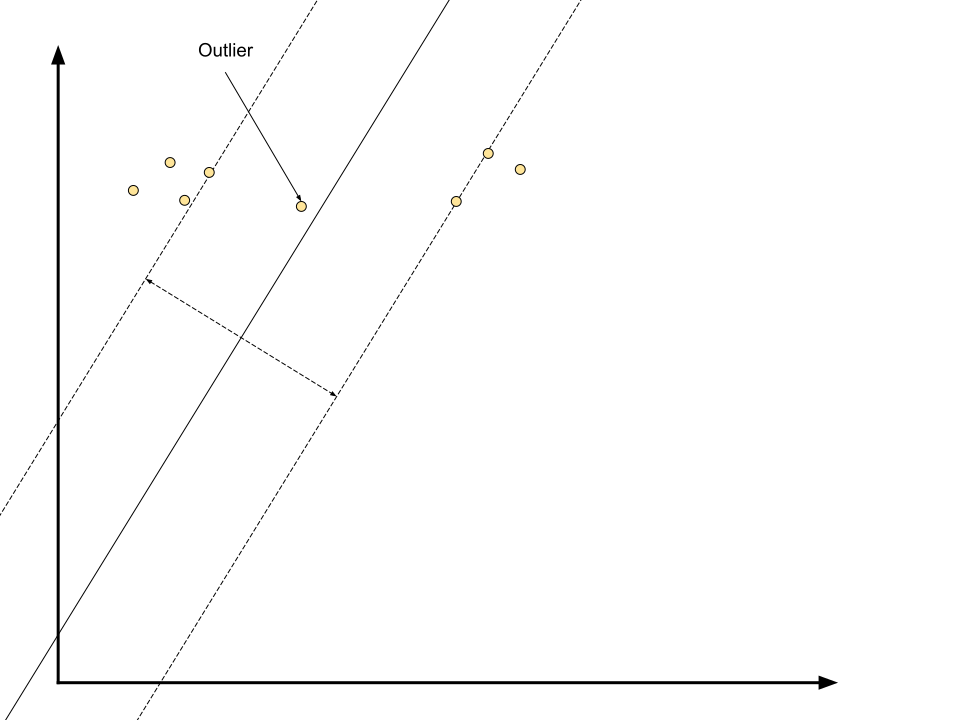
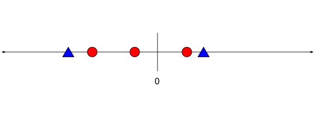
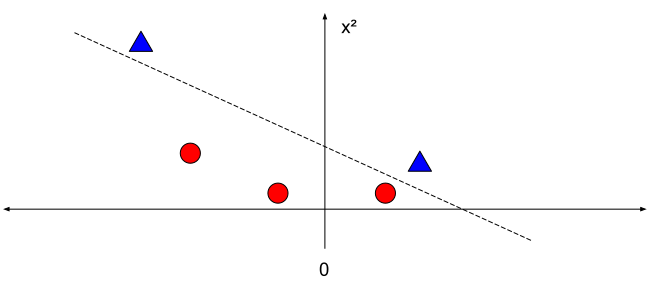
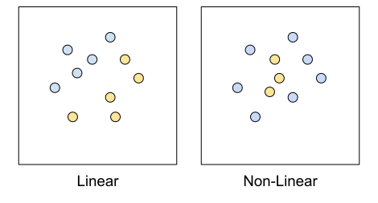
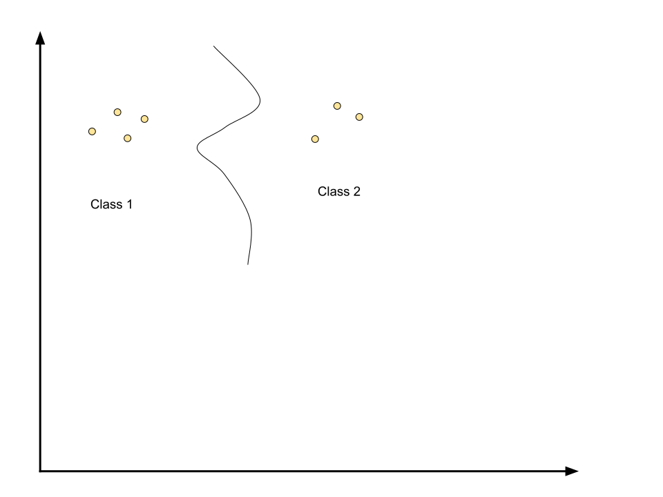

# Vector Space Classification
---

# Document as vector

    <!-- .element: style="border: none; box-shadow: none;" -->

---

    <!-- .element: style="border: none; box-shadow: none;" -->

---
# Rocchio Classification

Supports multiple classes

1. Compute center of mass / centroid for class
2. Assign documents to class of the nearest centroid

---

# Rocchio Classification

    <!-- .element: style="border: none; box-shadow: none;" -->

Notes:

What is the class of the new document?
---

# k Nearest Neighbor (kNN)

Supports multiple classes

* Assign document to class of the majority of the k nearest neighbours
* $k = 1$: Closest neighbor
* Usually $k = 3$ or $k = 5$

---

# k Nearest Neighbor (kNN)

    <!-- .element: style="border: none; box-shadow: none;" -->

Notes:

What's the class?
---

# Support Vector Machines (SVM)

Supports exactly two classes

* Separate documents into two classes
* By drawing a _line_ between the two classes

Notes:
---

# Which _line_?

    <!-- .element: style="border: none; box-shadow: none;" -->

Notes:

Audience question. Which line and why?
---

# Hyperplane

* 1 dimensional: point
* 2 dimensional: line
* 3 dimensional: plane

Notes:
---

# Which hyperplane?

Choose hyperplane with largest margin:

Larger margin

&darr;

More wiggle room for both classes

&darr;

More confident decision

Notes:
---

# Hyperplane with largest margin

    <!-- .element: style="border: none; box-shadow: none;" -->

Notes:
---

# SVM Outliers

    <!-- .element: style="border: none; box-shadow: none;" -->

Notes:
---

# Outliers decrease margin

    <!-- .element: style="border: none; box-shadow: none;" -->

Notes:
---

# SVM Outliers

* Outliers could be noise
* Ignore for greater margin
* Pay penalty for each outlier

Notes:
---

# SVM Outliers

    <!-- .element: style="border: none; box-shadow: none;" -->

Notes:
---

# Linearly inseparable data

    <!-- .element: style="border: none; box-shadow: none;" -->

Notes:
---
# SVM Kernel Trick

Transform to higher dimension

    <!-- .element: style="border: none; box-shadow: none;" -->

Notes:
---
# Which classifier to use?

* Is the problem linear?
* Can a hyperplane separate the classes?

    <!-- .element: style="border: none; box-shadow: none;" -->

---
# Classifier types

* Linear classifier: Separates classes with hyperplane
* Non-Linear classifier: Opposite
* Linear classifier is more robust
* But cannot solve non-linear problems

Notes:
---

# Is classifier linear?

1. Classify new document
2. Do this many times
3. Is border between classes a hyperplane?

---

# Rocchio Classification: Linear?

    <!-- .element: style="border: none; box-shadow: none;" -->

---
# Rocchio Classification: Linear

    <!-- .element: style="border: none; box-shadow: none;" -->

---
# kNN: Linear?

    <!-- .element: style="border: none; box-shadow: none;" -->

---
# kNN: Non-Linear

    <!-- .element: style="border: none; box-shadow: none;" -->

---
# SVM

    <!-- .element: style="border: none; box-shadow: none;" -->

Linear? *Yes*<!-- .element: class="fragment" data-fragment-index="" -->
Notes:
---

    <!-- .element: style="border: none; box-shadow: none;" -->

* Bias: *high*<!-- .element: class="fragment" data-fragment-index="" -->
* Variance: *low*<!-- .element: class="fragment" data-fragment-index="" -->

---

    <!-- .element: style="border: none; box-shadow: none;" -->

* Bias: *low*<!-- .element: class="fragment" data-fragment-index="" -->
* Variance: *high*<!-- .element: class="fragment" data-fragment-index="" -->

---

    <!-- .element: style="border: none; box-shadow: none;" -->

* Bias: *high*<!-- .element: class="fragment" data-fragment-index="" -->
* Variance: *low*<!-- .element: class="fragment" data-fragment-index="" -->
