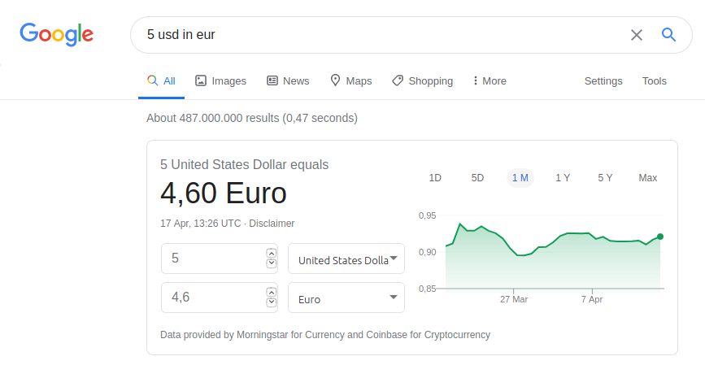
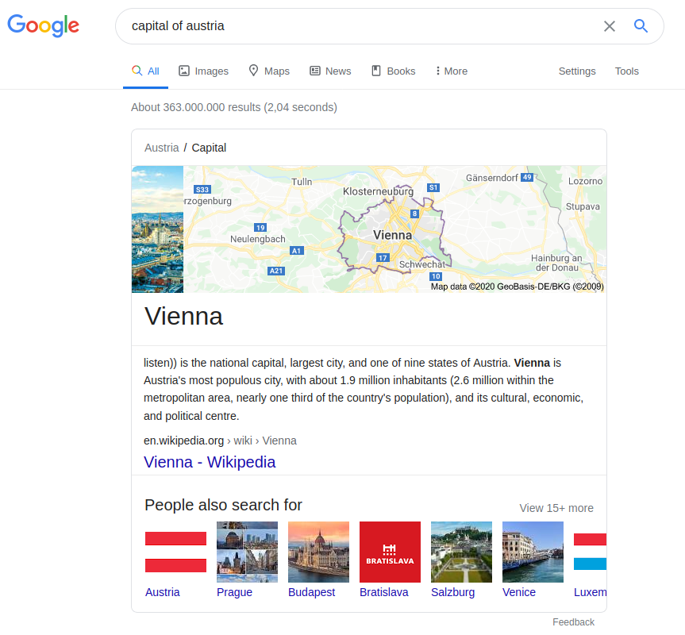
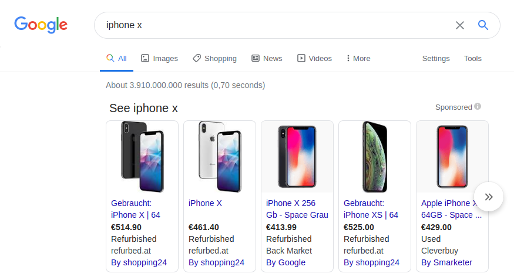
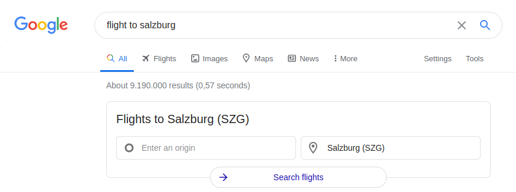
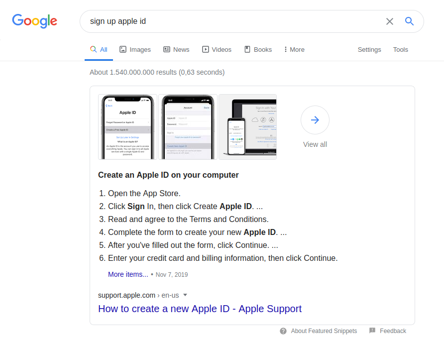
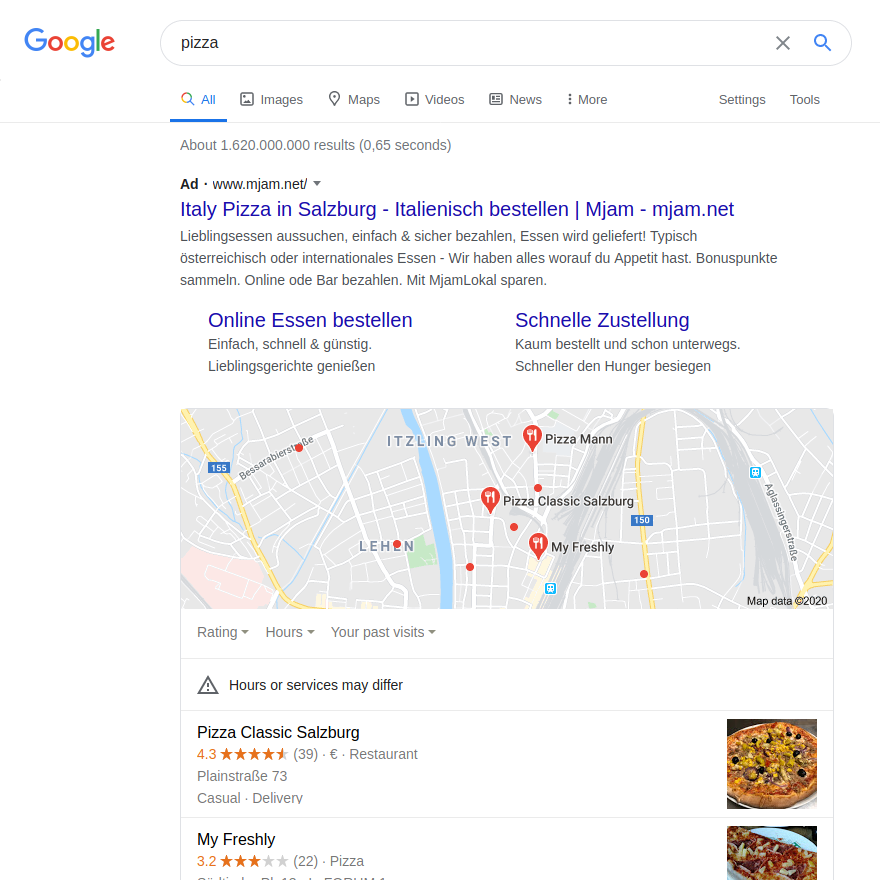
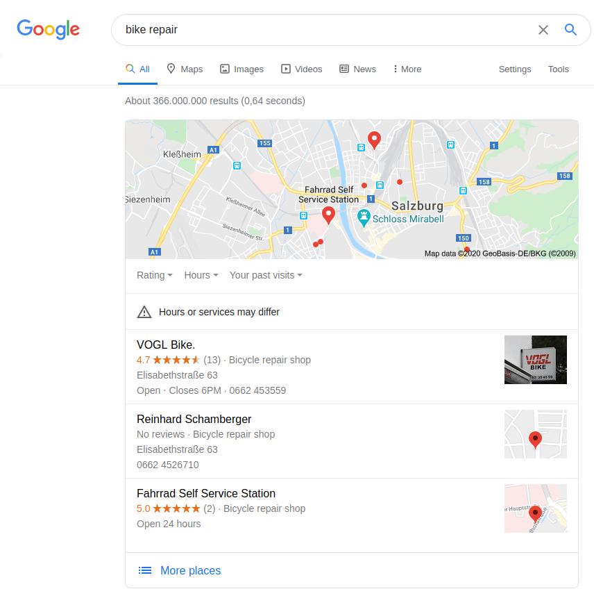
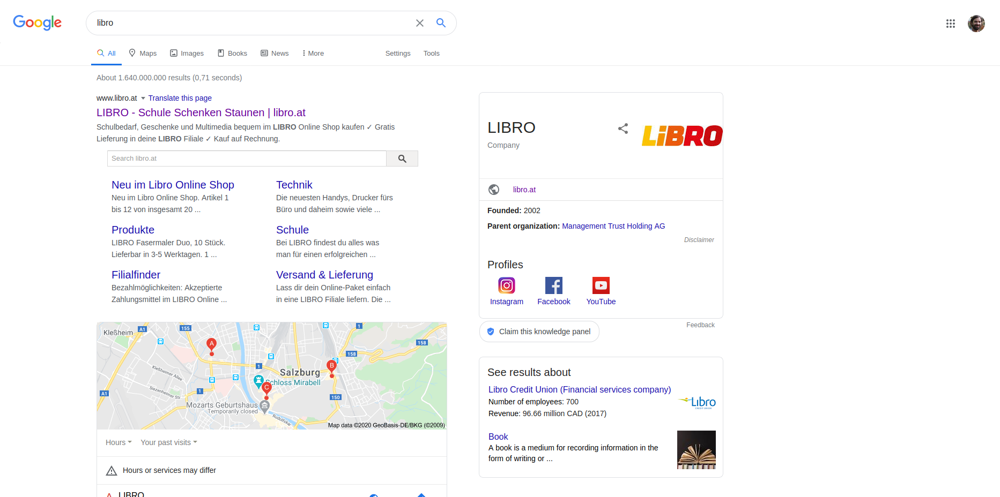

# Web search usage

Notes:
---
# User intents

Change search result page depending on intent

* Informational: Find information <!-- .element: class="fragment" data-fragment-index="" -->
* Navigational: Find homepage <!-- .element: class="fragment" data-fragment-index="" -->
* Transactional: Find product <!-- .element: class="fragment" data-fragment-index="" -->
* Local: Find place <!-- .element: class="fragment" data-fragment-index="" -->

Notes:
What are the four most important types of web search queries?
---
# Informational queries

## Know

Majority of search traffic

* "computer science" <!-- .element: class="fragment" data-fragment-index="" -->
* "salzburg sights" <!-- .element: class="fragment" data-fragment-index="" -->
* "lolcats" <!-- .element: class="fragment" data-fragment-index="" -->

Notes:

Examples?
---
# Informational queries

## Know simple

Clear facts

* "how old is sebastian kurz" <!-- .element: class="fragment" data-fragment-index="" -->
* "5 usd in eur" <!-- .element: class="fragment" data-fragment-index="" -->
* "capitol of austria" <!-- .element: class="fragment" data-fragment-index="" -->

Notes:
Examples?
---

Notes:
---

Notes:
---
# Navigational queries

## Go

* "fh salzburg homepage" <!-- .element: class="fragment" data-fragment-index="" -->
* "youtube" <!-- .element: class="fragment" data-fragment-index="" -->
* "apple.com" <!-- .element: class="fragment" data-fragment-index="" -->

Notes:

Examples?
---
# Transactional queries

## Do

* "buy iphone 7" <!-- .element: class="fragment" data-fragment-index="" -->
* "flight to salzburg" <!-- .element: class="fragment" data-fragment-index="" -->
* "viagra" <!-- .element: class="fragment" data-fragment-index="" -->

Notes:

Examples?
---

Notes:
---

Notes:
---

Notes:
---
# Local queries

## Visit-in-person

* "pizza place" <!-- .element: class="fragment" data-fragment-index="" -->
* "bike repair" <!-- .element: class="fragment" data-fragment-index="" -->
* "fh salzburg" <!-- .element: class="fragment" data-fragment-index="" -->

Notes:
Examples?
---

Notes:
---

Notes:
---
# Interpretation

* Often subjective
* "iphone"<!-- .element: class="fragment" data-fragment-index="" -->
    * Informational or transactional?<!-- .element: class="fragment" data-fragment-index="" -->
* "libro"<!-- .element: class="fragment" data-fragment-index="" -->
    * Navigational or visit-in-person?<!-- .element: class="fragment" data-fragment-index="" -->

Notes:
Which intents can be applied to the example queries?
---

Notes:
---
# But wait, there's more

[Google Search Quality Evaluator Guidelines](https://www.google.com/insidesearch/howsearchworks/assets/searchqualityevaluatorguidelines.pdf)

Notes:
---
# Web search users

* Not professionals
* Do not know the whole internet
* Do not know query syntax
* Want quick results

Notes:
---
# Query syntax

* 2-3 query terms
* No boolean operators
* No wildcards
* Maybe phrases

Notes:
---
# Conclusion

* Don't require query syntax
* High precision on first result page
* Keep result page lightweight

Notes:
